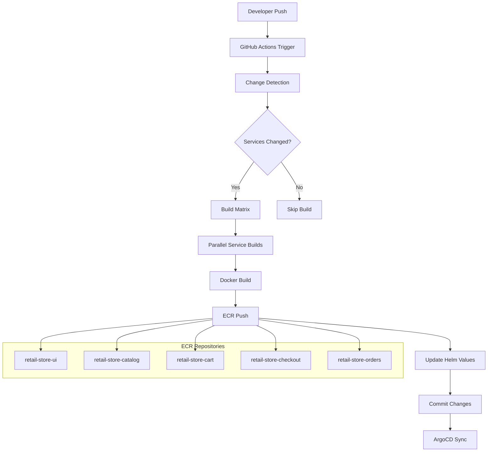

# Design Document

## Overview

This design outlines the GitHub Actions workflows for the retail store sample application's CI/CD pipeline. The solution implements automated change detection, Docker image building and pushing to Amazon ECR, and Helm chart value updates for GitOps deployment. The design supports the existing dual-branch strategy (main for public images, gitops for production) while adding comprehensive automation for the production workflow.

## Architecture

### High-Level Architecture



### Workflow Trigger Strategy

The workflows will be triggered by:
1. **Push events** to the `gitops` branch with changes in `src/` directory
2. **Manual dispatch** for building all services
3. **Pull request events** for validation (build-only, no push)

### Change Detection Logic

```yaml
# Path-based change detection
services:
  ui: src/ui/**
  catalog: src/catalog/**
  cart: src/cart/**
  checkout: src/checkout/**
  orders: src/orders/**
```

## Components and Interfaces

### 1. Main Workflow File (.github/workflows/ci-cd.yml)

**Purpose**: Orchestrates the entire CI/CD pipeline
**Triggers**: Push to gitops branch, manual dispatch, pull requests
**Outputs**: Build status, image URIs, deployment status

**Key Features**:
- Change detection using GitHub's `paths` filter
- Dynamic matrix generation for parallel builds
- Conditional execution based on changed services
- Secure credential management

### 2. Service Build Jobs

**Purpose**: Build and push individual service Docker images
**Inputs**: Service name, AWS credentials, commit SHA
**Outputs**: ECR image URI, build status

**Build Process**:
1. Checkout code
2. Configure AWS credentials
3. Login to ECR
4. Build Docker image with multi-stage optimization
5. Tag with commit SHA (7 characters)
6. Push to ECR repository
7. Create repository if it doesn't exist

### 3. Helm Chart Update Job

**Purpose**: Update Helm chart values with new image tags
**Dependencies**: Successful service builds
**Inputs**: Service names, new image URIs
**Outputs**: Updated values.yaml files

**Update Process**:
1. Checkout code with write permissions
2. Update each service's values.yaml file
3. Preserve infrastructure image configurations
4. Commit changes with descriptive message
5. Push back to gitops branch

### 4. ECR Repository Management

**Purpose**: Ensure ECR repositories exist for all services
**Strategy**: Create repositories on-demand during build process
**Configuration**: 
- Image scanning enabled
- Lifecycle policies for image cleanup
- Proper tagging strategy

## Data Models

### Service Configuration

```yaml
services:
  - name: ui
    path: src/ui
    dockerfile: src/ui/Dockerfile
    context: src/ui
    chart_path: src/ui/chart/values.yaml
    ecr_repo: retail-store-ui
    
  - name: catalog
    path: src/catalog
    dockerfile: src/catalog/Dockerfile
    context: src/catalog
    chart_path: src/catalog/chart/values.yaml
    ecr_repo: retail-store-catalog
    
  # ... additional services
```

### Workflow Outputs

```yaml
outputs:
  services_built:
    description: "JSON array of services that were built"
    value: ${{ steps.build-matrix.outputs.services }}
  
  image_uris:
    description: "JSON object mapping service names to ECR URIs"
    value: ${{ steps.collect-uris.outputs.uris }}
  
  deployment_status:
    description: "Status of Helm chart updates"
    value: ${{ steps.update-charts.outputs.status }}
```

### Environment Variables

```yaml
env:
  AWS_REGION: ${{ secrets.AWS_REGION }}
  AWS_ACCOUNT_ID: ${{ secrets.AWS_ACCOUNT_ID }}
  ECR_REGISTRY: ${{ secrets.AWS_ACCOUNT_ID }}.dkr.ecr.${{ secrets.AWS_REGION }}.amazonaws.com
  COMMIT_SHA: ${{ github.sha }}
  SHORT_SHA: ${{ github.sha:0:7 }}
```

## Error Handling

### Build Failures

1. **Docker Build Errors**:
   - Fail fast on syntax errors
   - Provide detailed error logs
   - Continue building other services in parallel

2. **ECR Push Errors**:
   - Retry mechanism for transient failures
   - Automatic repository creation
   - Clear error messages for permission issues

3. **Authentication Failures**:
   - Validate AWS credentials early
   - Provide troubleshooting guidance
   - Fail workflow immediately on auth errors

### Helm Chart Update Failures

1. **Git Conflicts**:
   - Pull latest changes before updating
   - Retry mechanism for concurrent updates
   - Clear conflict resolution messages

2. **File Permission Errors**:
   - Use appropriate GitHub token permissions
   - Validate write access early
   - Provide clear error messages

### Recovery Strategies

```yaml
# Retry strategy for transient failures
- name: Push to ECR with retry
  uses: nick-invision/retry@v2
  with:
    timeout_minutes: 10
    max_attempts: 3
    command: |
      docker push $ECR_REGISTRY/$SERVICE_NAME:$SHORT_SHA
```

## Testing Strategy

### Unit Testing

1. **Workflow Syntax Validation**:
   - GitHub Actions workflow linting
   - YAML syntax validation
   - Shell script validation with shellcheck

2. **Change Detection Testing**:
   - Test path filters with various change scenarios
   - Validate matrix generation logic
   - Test conditional job execution

### Integration Testing

1. **End-to-End Pipeline Testing**:
   - Test complete workflow with sample changes
   - Validate ECR integration
   - Test Helm chart updates

2. **Multi-Service Testing**:
   - Test parallel builds
   - Validate dependency management
   - Test failure isolation

### Security Testing

1. **Credential Management**:
   - Validate secret usage
   - Test permission boundaries
   - Audit credential exposure

2. **Image Security**:
   - Enable ECR vulnerability scanning
   - Test image signing (future enhancement)
   - Validate base image security

## Implementation Details

### Change Detection Implementation

```yaml
# Use GitHub's built-in path filtering
on:
  push:
    branches: [gitops]
    paths:
      - 'src/ui/**'
      - 'src/catalog/**'
      - 'src/cart/**'
      - 'src/checkout/**'
      - 'src/orders/**'
```

### Dynamic Matrix Generation

```yaml
# Generate build matrix based on changed files
- name: Detect changed services
  id: changes
  run: |
    services=()
    if [[ "${{ github.event_name }}" == "workflow_dispatch" ]]; then
      services=("ui" "catalog" "cart" "checkout" "orders")
    else
      # Detect changes using git diff
      changed_files=$(git diff --name-only ${{ github.event.before }} ${{ github.sha }})
      for service in ui catalog cart checkout orders; do
        if echo "$changed_files" | grep -q "^src/$service/"; then
          services+=("$service")
        fi
      done
    fi
    echo "services=$(printf '%s\n' "${services[@]}" | jq -R . | jq -s .)" >> $GITHUB_OUTPUT
```

### ECR Repository Management

```yaml
# Create ECR repository if it doesn't exist
- name: Create ECR repository
  run: |
    aws ecr describe-repositories --repository-names $SERVICE_NAME || \
    aws ecr create-repository \
      --repository-name $SERVICE_NAME \
      --image-scanning-configuration scanOnPush=true \
      --lifecycle-policy-text file://ecr-lifecycle-policy.json
```

### Helm Chart Update Strategy

```yaml
# Update values.yaml preserving infrastructure images
- name: Update Helm values
  run: |
    # Use yq to update only the main service image
    yq eval '.image.repository = "${{ env.ECR_REGISTRY }}/${{ matrix.service }}"' -i src/${{ matrix.service }}/chart/values.yaml
    yq eval '.image.tag = "${{ env.SHORT_SHA }}"' -i src/${{ matrix.service }}/chart/values.yaml
```

## Security Considerations

### AWS Credentials

1. **Minimal Permissions**: IAM policy with only required ECR and EKS permissions
2. **Temporary Credentials**: Use OIDC provider for short-lived tokens (future enhancement)
3. **Secret Rotation**: Regular rotation of AWS access keys
4. **Audit Logging**: Enable CloudTra
il for access auditing

### GitHub Token Permissions

1. **Repository Access**: Use GitHub token with minimal required permissions
2. **Branch Protection**: Ensure workflows can't bypass branch protection rules
3. **Secret Access**: Limit secret access to specific workflows only

### Container Security

1. **Base Image Security**: Use official AWS Linux images with security updates
2. **Vulnerability Scanning**: Enable ECR image scanning for all pushed images
3. **Image Signing**: Plan for future implementation of image signing with cosign

## Performance Optimizations

### Build Optimization

1. **Docker Layer Caching**: Utilize GitHub Actions cache for Docker layers
2. **Multi-stage Builds**: Optimize Dockerfile for smaller final images
3. **Parallel Execution**: Build multiple services simultaneously when possible

### ECR Optimization

1. **Image Compression**: Use efficient compression for image layers
2. **Lifecycle Policies**: Implement policies to clean up old images
3. **Regional Optimization**: Use ECR in the same region as EKS cluster

### Workflow Optimization

1. **Conditional Execution**: Skip unnecessary steps based on change detection
2. **Job Dependencies**: Optimize job dependency chains
3. **Resource Allocation**: Use appropriate runner sizes for different tasks

## Monitoring and Observability

### Workflow Monitoring

1. **Build Status**: Clear status indicators for each service build
2. **Execution Time**: Track build and deployment times
3. **Failure Notifications**: Integrate with team communication tools

### ECR Monitoring

1. **Image Push Events**: Track successful and failed pushes
2. **Repository Metrics**: Monitor repository size and image count
3. **Security Scan Results**: Track vulnerability scan outcomes

### ArgoCD Integration

1. **Sync Status**: Monitor ArgoCD application sync status
2. **Deployment Health**: Track application health after deployments
3. **Rollback Triggers**: Automated rollback on deployment failures

## Integration Points

### GitHub Integration

- **Status Checks**: Provide build status for pull requests
- **Commit Status**: Update commit status with build results
- **Release Integration**: Future integration with GitHub releases

### AWS Integration

- **ECR**: Primary container registry for private images
- **EKS**: Target deployment platform
- **CloudWatch**: Logging and monitoring integration

### ArgoCD Integration

- **Git Polling**: ArgoCD monitors gitops branch for changes
- **Application Sync**: Automatic synchronization of updated Helm charts
- **Health Checks**: Application health monitoring post-deployment

## Future Enhancements

### Security Enhancements

1. **OIDC Integration**: Replace long-lived AWS keys with OIDC tokens
2. **Image Signing**: Implement cosign for container image signing
3. **Policy as Code**: Implement OPA policies for deployment validation

### Workflow Enhancements

1. **Canary Deployments**: Implement progressive deployment strategies
2. **Automated Testing**: Add integration and smoke tests
3. **Performance Testing**: Automated performance regression testing

### Monitoring Enhancements

1. **Slack Integration**: Real-time notifications for build status
2. **Metrics Dashboard**: Comprehensive CI/CD metrics dashboard
3. **Cost Optimization**: Track and optimize AWS resource costs

## Deployment Strategy

### Rollout Plan

1. **Phase 1**: Implement basic CI/CD workflow for single service
2. **Phase 2**: Extend to all services with parallel builds
3. **Phase 3**: Add advanced features like automated testing and notifications

### Rollback Strategy

1. **Git Revert**: Simple rollback by reverting commits
2. **Image Rollback**: Ability to deploy previous image versions
3. **ArgoCD Rollback**: Use ArgoCD's built-in rollback capabilities

### Validation Criteria

1. **Build Success**: All services build successfully
2. **Image Push**: Images successfully pushed to ECR
3. **Chart Update**: Helm charts updated correctly
4. **ArgoCD Sync**: Applications sync successfully in ArgoCD

This design provides a comprehensive, secure, and scalable CI/CD solution that aligns with the existing GitOps strategy while adding the automation needed for efficient development workflows.