# Retail Store Sample App - Complete Architecture Documentation

## Table of Contents

1. [Overview](#overview)
2. [System Architecture](#system-architecture)
3. [Infrastructure Architecture](#infrastructure-architecture)
4. [Microservices Architecture](#microservices-architecture)
5. [CI/CD Pipeline](#cicd-pipeline)
6. [GitOps Workflow](#gitops-workflow)
7. [Deployment Architecture](#deployment-architecture)
8. [Technology Stack](#technology-stack)
9. [Security Architecture](#security-architecture)
10. [Monitoring and Observability](#monitoring-and-observability)
11. [Data Flow](#data-flow)
12. [Branching Strategy](#branching-strategy)
13. [Troubleshooting Guide](#troubleshooting-guide)

## Overview

The Retail Store Sample App is a modern, cloud-native microservices application deployed on AWS EKS using GitOps principles. It demonstrates best practices for containerized applications, infrastructure as code, and automated deployment pipelines.

### Key Features

- **Microservices Architecture**: 5 independent services (UI, Catalog, Cart, Checkout, Orders)
- **Cloud-Native**: Deployed on AWS EKS with Auto Mode
- **GitOps**: Automated deployment using ArgoCD
- **Infrastructure as Code**: Terraform for AWS resources
- **CI/CD Pipeline**: GitHub Actions for automated builds and deployments
- **Multi-Language**: Java, Go, Node.js/TypeScript services
- **Observability**: Prometheus metrics, health checks, and distributed tracing

## System Architecture

### High-Level Architecture

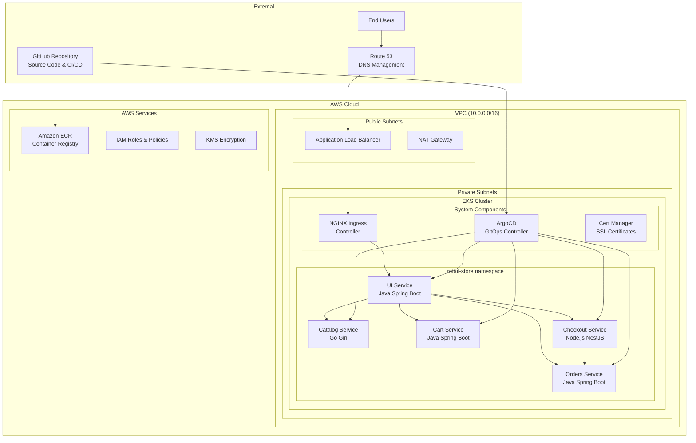
```mermaid
graph TB
    subgraph "AWS Cloud"
        subgraph "VPC (10.0.0.0/16)"
            subgraph "Public Subnets"
                ALB[Application Load Balancer]
                NAT[NAT Gateway]
            end
            
            subgraph "Private Subnets"
                subgraph "EKS Cluster"
                    subgraph "retail-store namespace"
                        UI[UI Service<br/>Java Spring Boot]
                        CAT[Catalog Service<br/>Go Gin]
                        CART[Cart Service<br/>Java Spring Boot]
                        CHECK[Checkout Service<br/>Node.js NestJS]
                        ORD[Orders Service<br/>Java Spring Boot]
                    end
                    
                    subgraph "System Components"
                        ARGOCD[ArgoCD<br/>GitOps Controller]
                        NGINX[NGINX Ingress<br/>Controller]
                        CERT[Cert Manager<br/>SSL Certificates]
                    end
                end
            end
        end
        
        subgraph "AWS Services"
            ECR[Amazon ECR<br/>Container Registry]
            IAM[IAM Roles & Policies]
            KMS[KMS Encryption]
        end
    end
    
    subgraph "External"
        GITHUB[GitHub Repository<br/>Source Code & CI/CD]
        USERS[End Users]
        DNS[Route 53<br/>DNS Management]
    end
    
    USERS --> DNS
    DNS --> ALB
    ALB --> NGINX
    NGINX --> UI
    UI --> CAT
    UI --> CART
    UI --> CHECK
    UI --> ORD
    CHECK --> ORD
    
    GITHUB --> ARGOCD
    GITHUB --> ECR
    ARGOCD --> UI
    ARGOCD --> CAT
    ARGOCD --> CART
    ARGOCD --> CHECK
    ARGOCD --> ORD
```

## Infrastructure Architecture

### AWS Infrastructure Components

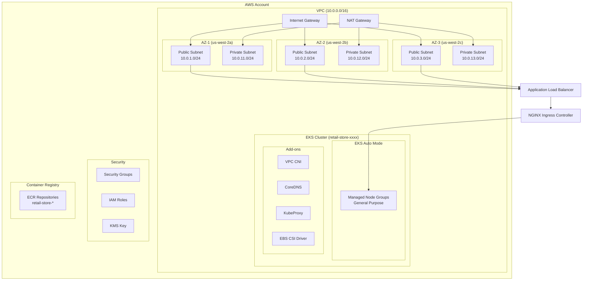
```mermaid
graph TB
    subgraph "AWS Account"
        subgraph "VPC (10.0.0.0/16)"
            subgraph "AZ-1 (us-west-2a)"
                PUB1[Public Subnet<br/>10.0.1.0/24]
                PRIV1[Private Subnet<br/>10.0.11.0/24]
            end
            
            subgraph "AZ-2 (us-west-2b)"
                PUB2[Public Subnet<br/>10.0.2.0/24]
                PRIV2[Private Subnet<br/>10.0.12.0/24]
            end
            
            subgraph "AZ-3 (us-west-2c)"
                PUB3[Public Subnet<br/>10.0.3.0/24]
                PRIV3[Private Subnet<br/>10.0.13.0/24]
            end
            
            IGW[Internet Gateway]
            NAT[NAT Gateway]
            
            subgraph "EKS Cluster (retail-store-xxxx)"
                subgraph "EKS Auto Mode"
                    NODES[Managed Node Groups<br/>General Purpose]
                end
                
                subgraph "Add-ons"
                    CNI[VPC CNI]
                    CORE[CoreDNS]
                    KUBE[KubeProxy]
                    EBS[EBS CSI Driver]
                end
            end
        end
        
        subgraph "Security"
            SG[Security Groups]
            IAM_ROLES[IAM Roles]
            KMS_KEY[KMS Key]
        end
        
        subgraph "Container Registry"
            ECR_REPOS[ECR Repositories<br/>retail-store-*]
        end
    end
    
    IGW --> PUB1
    IGW --> PUB2
    IGW --> PUB3
    
    NAT --> PRIV1
    NAT --> PRIV2
    NAT --> PRIV3
    
    PUB1 --> ALB[Application Load Balancer]
    PUB2 --> ALB
    PUB3 --> ALB
    
    ALB --> NGINX[NGINX Ingress Controller]
    NGINX --> NODES
```

### Terraform Infrastructure Structure

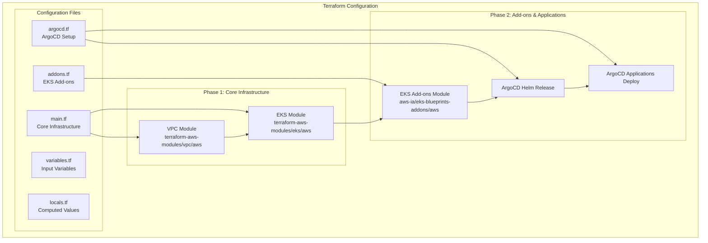
```mermaid
graph TB
    subgraph "Terraform Configuration"
        subgraph "Phase 1: Core Infrastructure"
            VPC_MOD[VPC Module<br/>terraform-aws-modules/vpc/aws]
            EKS_MOD[EKS Module<br/>terraform-aws-modules/eks/aws]
        end
        
        subgraph "Phase 2: Add-ons & Applications"
            ADDONS_MOD[EKS Add-ons Module<br/>aws-ia/eks-blueprints-addons/aws]
            ARGOCD_HELM[ArgoCD Helm Release]
            APPS_DEPLOY[ArgoCD Applications Deploy]
        end
        
        subgraph "Configuration Files"
            MAIN_TF[main.tf<br/>Core Infrastructure]
            VARS_TF[variables.tf<br/>Input Variables]
            LOCALS_TF[locals.tf<br/>Computed Values]
            ADDONS_TF[addons.tf<br/>EKS Add-ons]
            ARGOCD_TF[argocd.tf<br/>ArgoCD Setup]
        end
    end
    
    MAIN_TF --> VPC_MOD
    MAIN_TF --> EKS_MOD
    ADDONS_TF --> ADDONS_MOD
    ARGOCD_TF --> ARGOCD_HELM
    ARGOCD_TF --> APPS_DEPLOY
    
    VPC_MOD --> EKS_MOD
    EKS_MOD --> ADDONS_MOD
    ADDONS_MOD --> ARGOCD_HELM
    ARGOCD_HELM --> APPS_DEPLOY
```

## Microservices Architecture

### Service Communication Flow

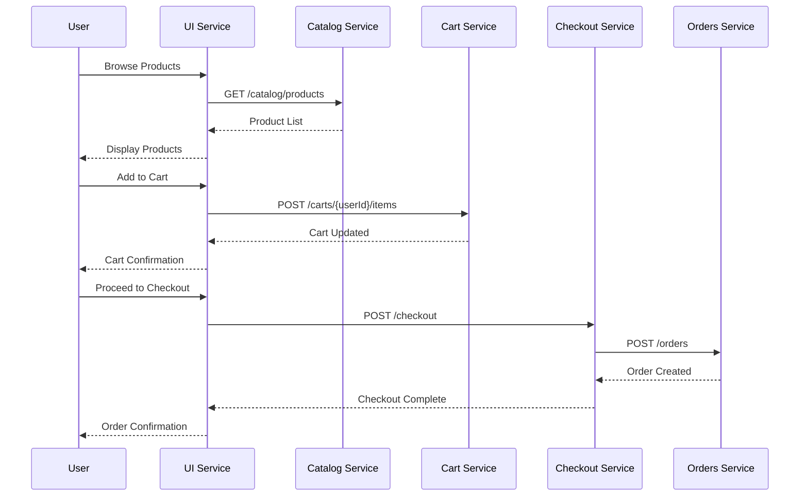
```mermaid
sequenceDiagram
    participant U as User
    participant UI as UI Service
    participant CAT as Catalog Service
    participant CART as Cart Service
    participant CHECK as Checkout Service
    participant ORD as Orders Service
    
    U->>UI: Browse Products
    UI->>CAT: GET /catalog/products
    CAT-->>UI: Product List
    UI-->>U: Display Products
    
    U->>UI: Add to Cart
    UI->>CART: POST /carts/{userId}/items
    CART-->>UI: Cart Updated
    UI-->>U: Cart Confirmation
    
    U->>UI: Proceed to Checkout
    UI->>CHECK: POST /checkout
    CHECK->>ORD: POST /orders
    ORD-->>CHECK: Order Created
    CHECK-->>UI: Checkout Complete
    UI-->>U: Order Confirmation
```

### Service Details

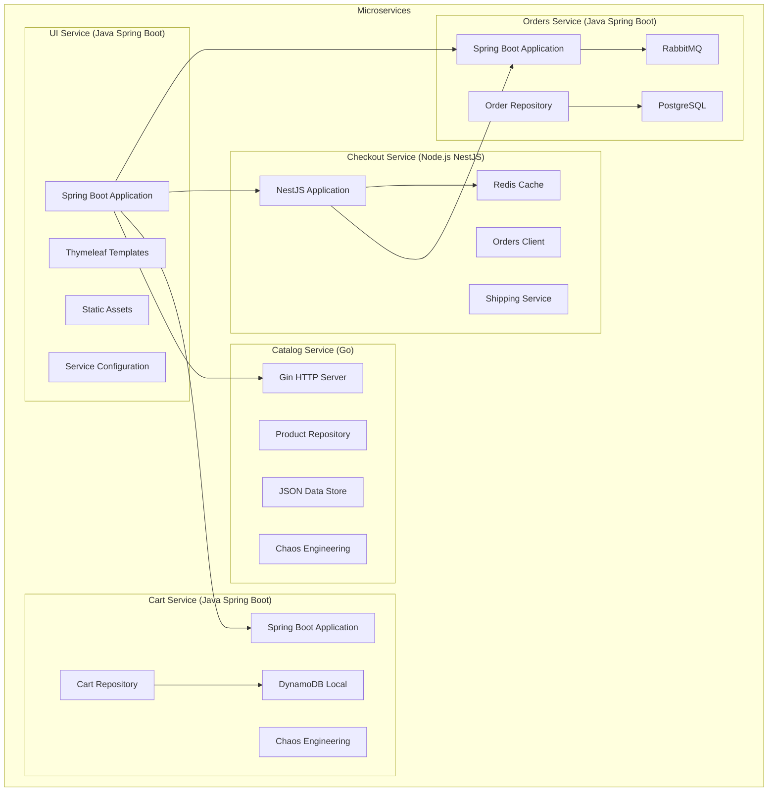
```mermaid
graph TB
    subgraph "Microservices"
        subgraph "UI Service (Java Spring Boot)"
            UI_APP[Spring Boot Application]
            UI_TEMPLATES[Thymeleaf Templates]
            UI_STATIC[Static Assets]
            UI_CONFIG[Service Configuration]
        end
        
        subgraph "Catalog Service (Go)"
            CAT_API[Gin HTTP Server]
            CAT_REPO[Product Repository]
            CAT_DATA[JSON Data Store]
            CAT_CHAOS[Chaos Engineering]
        end
        
        subgraph "Cart Service (Java Spring Boot)"
            CART_APP[Spring Boot Application]
            CART_REPO[Cart Repository]
            CART_DYNAMO[DynamoDB Local]
            CART_CHAOS[Chaos Engineering]
        end
        
        subgraph "Checkout Service (Node.js NestJS)"
            CHECK_APP[NestJS Application]
            CHECK_ORDERS[Orders Client]
            CHECK_SHIPPING[Shipping Service]
            CHECK_REDIS[Redis Cache]
        end
        
        subgraph "Orders Service (Java Spring Boot)"
            ORD_APP[Spring Boot Application]
            ORD_REPO[Order Repository]
            ORD_POSTGRES[PostgreSQL]
            ORD_RABBIT[RabbitMQ]
        end
    end
    
    UI_APP --> CAT_API
    UI_APP --> CART_APP
    UI_APP --> CHECK_APP
    UI_APP --> ORD_APP
    
    CHECK_APP --> ORD_APP
    
    CART_REPO --> CART_DYNAMO
    ORD_REPO --> ORD_POSTGRES
    ORD_APP --> ORD_RABBIT
    CHECK_APP --> CHECK_REDIS
```

## CI/CD Pipeline

### GitHub Actions Workflow

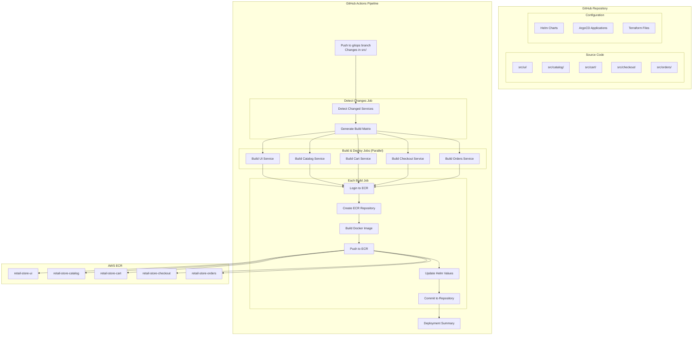
```mermaid
graph TB
    subgraph "GitHub Repository"
        subgraph "Source Code"
            SRC_UI[src/ui/]
            SRC_CAT[src/catalog/]
            SRC_CART[src/cart/]
            SRC_CHECK[src/checkout/]
            SRC_ORD[src/orders/]
        end
        
        subgraph "Configuration"
            HELM_CHARTS[Helm Charts]
            ARGOCD_APPS[ArgoCD Applications]
            TERRAFORM[Terraform Files]
        end
    end
    
    subgraph "GitHub Actions Pipeline"
        TRIGGER[Push to gitops branch<br/>Changes in src/]
        
        subgraph "Detect Changes Job"
            DETECT[Detect Changed Services]
            MATRIX[Generate Build Matrix]
        end
        
        subgraph "Build & Deploy Jobs (Parallel)"
            BUILD_UI[Build UI Service]
            BUILD_CAT[Build Catalog Service]
            BUILD_CART[Build Cart Service]
            BUILD_CHECK[Build Checkout Service]
            BUILD_ORD[Build Orders Service]
        end
        
        subgraph "Each Build Job"
            ECR_LOGIN[Login to ECR]
            CREATE_REPO[Create ECR Repository]
            BUILD_IMAGE[Build Docker Image]
            PUSH_IMAGE[Push to ECR]
            UPDATE_HELM[Update Helm Values]
            COMMIT_CHANGES[Commit to Repository]
        end
        
        SUMMARY[Deployment Summary]
    end
    
    subgraph "AWS ECR"
        ECR_UI[retail-store-ui]
        ECR_CAT[retail-store-catalog]
        ECR_CART[retail-store-cart]
        ECR_CHECK[retail-store-checkout]
        ECR_ORD[retail-store-orders]
    end
    
    TRIGGER --> DETECT
    DETECT --> MATRIX
    MATRIX --> BUILD_UI
    MATRIX --> BUILD_CAT
    MATRIX --> BUILD_CART
    MATRIX --> BUILD_CHECK
    MATRIX --> BUILD_ORD
    
    BUILD_UI --> ECR_LOGIN
    BUILD_CAT --> ECR_LOGIN
    BUILD_CART --> ECR_LOGIN
    BUILD_CHECK --> ECR_LOGIN
    BUILD_ORD --> ECR_LOGIN
    
    ECR_LOGIN --> CREATE_REPO
    CREATE_REPO --> BUILD_IMAGE
    BUILD_IMAGE --> PUSH_IMAGE
    PUSH_IMAGE --> UPDATE_HELM
    UPDATE_HELM --> COMMIT_CHANGES
    
    PUSH_IMAGE --> ECR_UI
    PUSH_IMAGE --> ECR_CAT
    PUSH_IMAGE --> ECR_CART
    PUSH_IMAGE --> ECR_CHECK
    PUSH_IMAGE --> ECR_ORD
    
    COMMIT_CHANGES --> SUMMARY
```

### Build Process Details

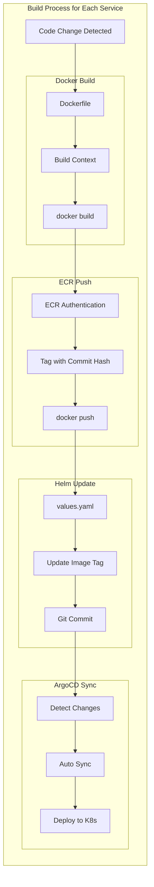
```mermaid
graph LR
    subgraph "Build Process for Each Service"
        START[Code Change Detected]
        
        subgraph "Docker Build"
            DOCKERFILE[Dockerfile]
            BUILD_CONTEXT[Build Context]
            DOCKER_BUILD[docker build]
        end
        
        subgraph "ECR Push"
            ECR_AUTH[ECR Authentication]
            ECR_TAG[Tag with Commit Hash]
            ECR_PUSH[docker push]
        end
        
        subgraph "Helm Update"
            HELM_VALUES[values.yaml]
            UPDATE_IMAGE[Update Image Tag]
            COMMIT[Git Commit]
        end
        
        subgraph "ArgoCD Sync"
            ARGOCD_DETECT[Detect Changes]
            ARGOCD_SYNC[Auto Sync]
            K8S_DEPLOY[Deploy to K8s]
        end
    end
    
    START --> DOCKERFILE
    DOCKERFILE --> BUILD_CONTEXT
    BUILD_CONTEXT --> DOCKER_BUILD
    DOCKER_BUILD --> ECR_AUTH
    ECR_AUTH --> ECR_TAG
    ECR_TAG --> ECR_PUSH
    ECR_PUSH --> HELM_VALUES
    HELM_VALUES --> UPDATE_IMAGE
    UPDATE_IMAGE --> COMMIT
    COMMIT --> ARGOCD_DETECT
    ARGOCD_DETECT --> ARGOCD_SYNC
    ARGOCD_SYNC --> K8S_DEPLOY
```

## GitOps Workflow

### ArgoCD Application Management

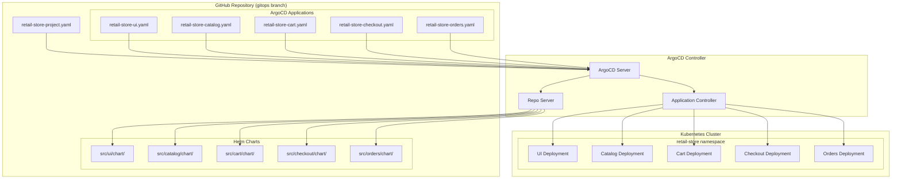
```mermaid
graph TB
    subgraph "GitHub Repository (gitops branch)"
        subgraph "Helm Charts"
            CHART_UI[src/ui/chart/]
            CHART_CAT[src/catalog/chart/]
            CHART_CART[src/cart/chart/]
            CHART_CHECK[src/checkout/chart/]
            CHART_ORD[src/orders/chart/]
        end
        
        subgraph "ArgoCD Applications"
            APP_UI[retail-store-ui.yaml]
            APP_CAT[retail-store-catalog.yaml]
            APP_CART[retail-store-cart.yaml]
            APP_CHECK[retail-store-checkout.yaml]
            APP_ORD[retail-store-orders.yaml]
        end
        
        PROJECT[retail-store-project.yaml]
    end
    
    subgraph "ArgoCD Controller"
        ARGOCD_SERVER[ArgoCD Server]
        ARGOCD_REPO[Repo Server]
        ARGOCD_APP[Application Controller]
    end
    
    subgraph "Kubernetes Cluster"
        subgraph "retail-store namespace"
            DEPLOY_UI[UI Deployment]
            DEPLOY_CAT[Catalog Deployment]
            DEPLOY_CART[Cart Deployment]
            DEPLOY_CHECK[Checkout Deployment]
            DEPLOY_ORD[Orders Deployment]
        end
    end
    
    PROJECT --> ARGOCD_SERVER
    APP_UI --> ARGOCD_SERVER
    APP_CAT --> ARGOCD_SERVER
    APP_CART --> ARGOCD_SERVER
    APP_CHECK --> ARGOCD_SERVER
    APP_ORD --> ARGOCD_SERVER
    
    ARGOCD_SERVER --> ARGOCD_REPO
    ARGOCD_REPO --> CHART_UI
    ARGOCD_REPO --> CHART_CAT
    ARGOCD_REPO --> CHART_CART
    ARGOCD_REPO --> CHART_CHECK
    ARGOCD_REPO --> CHART_ORD
    
    ARGOCD_SERVER --> ARGOCD_APP
    ARGOCD_APP --> DEPLOY_UI
    ARGOCD_APP --> DEPLOY_CAT
    ARGOCD_APP --> DEPLOY_CART
    ARGOCD_APP --> DEPLOY_CHECK
    ARGOCD_APP --> DEPLOY_ORD
```

### Sync Wave Strategy

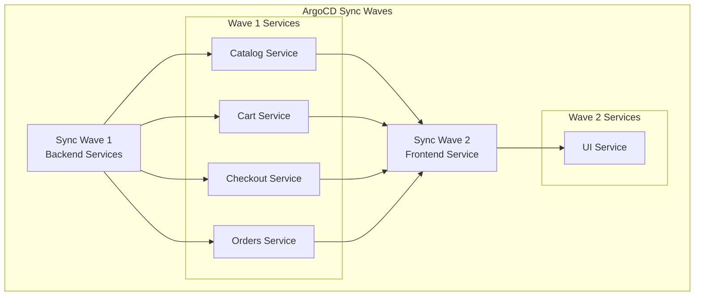
```mermaid
graph TB
    subgraph "ArgoCD Sync Waves"
        WAVE_1[Sync Wave 1<br/>Backend Services]
        WAVE_2[Sync Wave 2<br/>Frontend Service]
        
        subgraph "Wave 1 Services"
            CAT_W1[Catalog Service]
            CART_W1[Cart Service]
            CHECK_W1[Checkout Service]
            ORD_W1[Orders Service]
        end
        
        subgraph "Wave 2 Services"
            UI_W2[UI Service]
        end
    end
    
    WAVE_1 --> CAT_W1
    WAVE_1 --> CART_W1
    WAVE_1 --> CHECK_W1
    WAVE_1 --> ORD_W1
    
    CAT_W1 --> WAVE_2
    CART_W1 --> WAVE_2
    CHECK_W1 --> WAVE_2
    ORD_W1 --> WAVE_2
    
    WAVE_2 --> UI_W2
```

## Deployment Architecture

### Kubernetes Resource Hierarchy

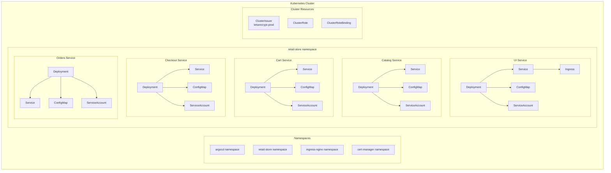
```mermaid
graph TB
    subgraph "Kubernetes Cluster"
        subgraph "Namespaces"
            NS_ARGOCD[argocd namespace]
            NS_RETAIL[retail-store namespace]
            NS_INGRESS[ingress-nginx namespace]
            NS_CERT[cert-manager namespace]
        end
        
        subgraph "retail-store namespace"
            subgraph "UI Service"
                UI_DEPLOY[Deployment]
                UI_SVC[Service]
                UI_INGRESS[Ingress]
                UI_CM[ConfigMap]
                UI_SA[ServiceAccount]
            end
            
            subgraph "Catalog Service"
                CAT_DEPLOY[Deployment]
                CAT_SVC[Service]
                CAT_CM[ConfigMap]
                CAT_SA[ServiceAccount]
            end
            
            subgraph "Cart Service"
                CART_DEPLOY[Deployment]
                CART_SVC[Service]
                CART_CM[ConfigMap]
                CART_SA[ServiceAccount]
            end
            
            subgraph "Checkout Service"
                CHECK_DEPLOY[Deployment]
                CHECK_SVC[Service]
                CHECK_CM[ConfigMap]
                CHECK_SA[ServiceAccount]
            end
            
            subgraph "Orders Service"
                ORD_DEPLOY[Deployment]
                ORD_SVC[Service]
                ORD_CM[ConfigMap]
                ORD_SA[ServiceAccount]
            end
        end
        
        subgraph "Cluster Resources"
            CLUSTER_ISSUER[ClusterIssuer<br/>letsencrypt-prod]
            CLUSTER_ROLE[ClusterRole]
            CLUSTER_RB[ClusterRoleBinding]
        end
    end
    
    UI_DEPLOY --> UI_SVC
    UI_SVC --> UI_INGRESS
    UI_DEPLOY --> UI_CM
    UI_DEPLOY --> UI_SA
    
    CAT_DEPLOY --> CAT_SVC
    CAT_DEPLOY --> CAT_CM
    CAT_DEPLOY --> CAT_SA
    
    CART_DEPLOY --> CART_SVC
    CART_DEPLOY --> CART_CM
    CART_DEPLOY --> CART_SA
    
    CHECK_DEPLOY --> CHECK_SVC
    CHECK_DEPLOY --> CHECK_CM
    CHECK_DEPLOY --> CHECK_SA
    
    ORD_DEPLOY --> ORD_SVC
    ORD_DEPLOY --> ORD_CM
    ORD_DEPLOY --> ORD_SA
```

### Network Flow

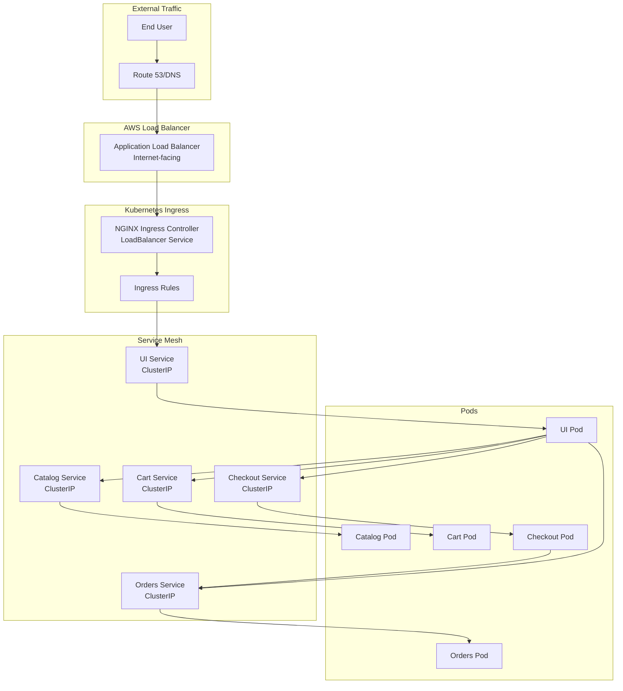
```mermaid
graph TB
    subgraph "External Traffic"
        USER[End User]
        DNS[Route 53/DNS]
    end
    
    subgraph "AWS Load Balancer"
        ALB[Application Load Balancer<br/>Internet-facing]
    end
    
    subgraph "Kubernetes Ingress"
        NGINX_INGRESS[NGINX Ingress Controller<br/>LoadBalancer Service]
        INGRESS_RULE[Ingress Rules]
    end
    
    subgraph "Service Mesh"
        UI_SVC[UI Service<br/>ClusterIP]
        CAT_SVC[Catalog Service<br/>ClusterIP]
        CART_SVC[Cart Service<br/>ClusterIP]
        CHECK_SVC[Checkout Service<br/>ClusterIP]
        ORD_SVC[Orders Service<br/>ClusterIP]
    end
    
    subgraph "Pods"
        UI_POD[UI Pod]
        CAT_POD[Catalog Pod]
        CART_POD[Cart Pod]
        CHECK_POD[Checkout Pod]
        ORD_POD[Orders Pod]
    end
    
    USER --> DNS
    DNS --> ALB
    ALB --> NGINX_INGRESS
    NGINX_INGRESS --> INGRESS_RULE
    INGRESS_RULE --> UI_SVC
    UI_SVC --> UI_POD
    
    UI_POD --> CAT_SVC
    UI_POD --> CART_SVC
    UI_POD --> CHECK_SVC
    UI_POD --> ORD_SVC
    
    CAT_SVC --> CAT_POD
    CART_SVC --> CART_POD
    CHECK_SVC --> CHECK_POD
    ORD_SVC --> ORD_POD
    
    CHECK_POD --> ORD_SVC
```

## Technology Stack

### Application Technologies

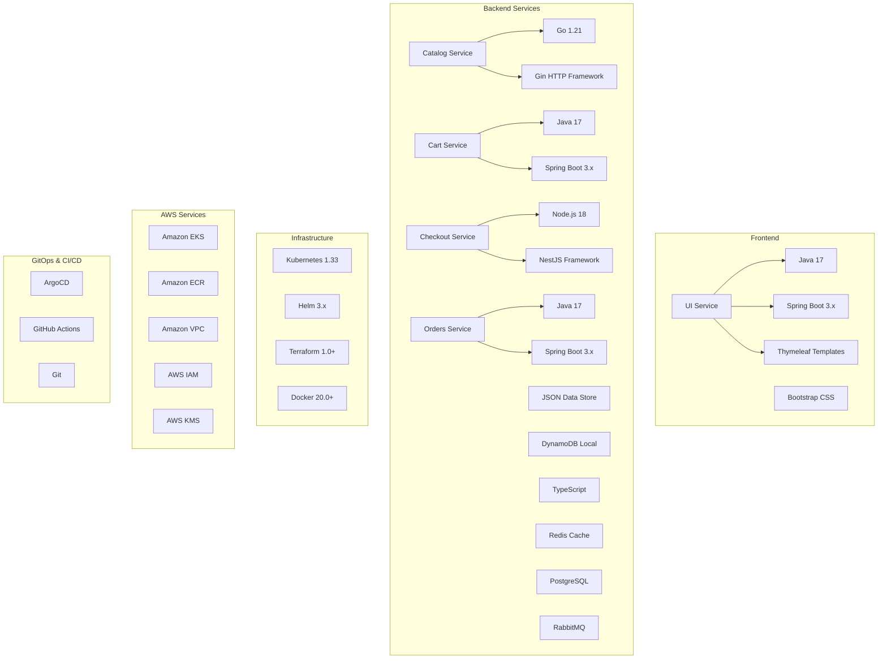
```mermaid
graph TB
    subgraph "Frontend"
        UI_TECH[UI Service]
        UI_JAVA[Java 17]
        UI_SPRING[Spring Boot 3.x]
        UI_THYMELEAF[Thymeleaf Templates]
        UI_BOOTSTRAP[Bootstrap CSS]
    end
    
    subgraph "Backend Services"
        CAT_TECH[Catalog Service]
        CAT_GO[Go 1.21]
        CAT_GIN[Gin HTTP Framework]
        CAT_JSON[JSON Data Store]
        
        CART_TECH[Cart Service]
        CART_JAVA[Java 17]
        CART_SPRING[Spring Boot 3.x]
        CART_DYNAMO[DynamoDB Local]
        
        CHECK_TECH[Checkout Service]
        CHECK_NODE[Node.js 18]
        CHECK_NEST[NestJS Framework]
        CHECK_TYPESCRIPT[TypeScript]
        CHECK_REDIS[Redis Cache]
        
        ORD_TECH[Orders Service]
        ORD_JAVA[Java 17]
        ORD_SPRING[Spring Boot 3.x]
        ORD_POSTGRES[PostgreSQL]
        ORD_RABBIT[RabbitMQ]
    end
    
    subgraph "Infrastructure"
        K8S[Kubernetes 1.33]
        HELM[Helm 3.x]
        TERRAFORM[Terraform 1.0+]
        DOCKER[Docker 20.0+]
    end
    
    subgraph "AWS Services"
        EKS[Amazon EKS]
        ECR[Amazon ECR]
        VPC[Amazon VPC]
        IAM[AWS IAM]
        KMS[AWS KMS]
    end
    
    subgraph "GitOps & CI/CD"
        ARGOCD[ArgoCD]
        GITHUB_ACTIONS[GitHub Actions]
        GIT[Git]
    end
    
    UI_TECH --> UI_JAVA
    UI_TECH --> UI_SPRING
    UI_TECH --> UI_THYMELEAF
    
    CAT_TECH --> CAT_GO
    CAT_TECH --> CAT_GIN
    
    CART_TECH --> CART_JAVA
    CART_TECH --> CART_SPRING
    
    CHECK_TECH --> CHECK_NODE
    CHECK_TECH --> CHECK_NEST
    
    ORD_TECH --> ORD_JAVA
    ORD_TECH --> ORD_SPRING
```

### Container Images

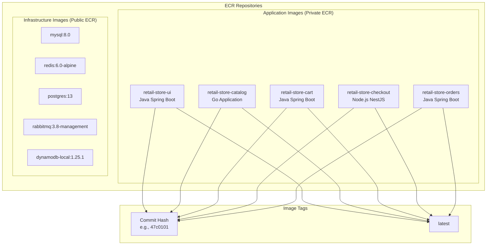
```mermaid
graph TB
    subgraph "ECR Repositories"
        subgraph "Application Images (Private ECR)"
            ECR_UI[retail-store-ui<br/>Java Spring Boot]
            ECR_CAT[retail-store-catalog<br/>Go Application]
            ECR_CART[retail-store-cart<br/>Java Spring Boot]
            ECR_CHECK[retail-store-checkout<br/>Node.js NestJS]
            ECR_ORD[retail-store-orders<br/>Java Spring Boot]
        end
        
        subgraph "Infrastructure Images (Public ECR)"
            ECR_MYSQL[mysql:8.0]
            ECR_REDIS[redis:6.0-alpine]
            ECR_POSTGRES[postgres:13]
            ECR_RABBITMQ[rabbitmq:3.8-management]
            ECR_DYNAMODB[dynamodb-local:1.25.1]
        end
    end
    
    subgraph "Image Tags"
        COMMIT_TAG[Commit Hash<br/>e.g., 47c0101]
        LATEST_TAG[latest]
    end
    
    ECR_UI --> COMMIT_TAG
    ECR_CAT --> COMMIT_TAG
    ECR_CART --> COMMIT_TAG
    ECR_CHECK --> COMMIT_TAG
    ECR_ORD --> COMMIT_TAG
    
    ECR_UI --> LATEST_TAG
    ECR_CAT --> LATEST_TAG
    ECR_CART --> LATEST_TAG
    ECR_CHECK --> LATEST_TAG
    ECR_ORD --> LATEST_TAG
```

## Security Architecture

### Security Layers


```mermaid
graph TB
    subgraph "Security Architecture"
        subgraph "Network Security"
            VPC_SEC[VPC Isolation]
            SG_SEC[Security Groups]
            NACL_SEC[Network ACLs]
            PRIVATE_SUBNETS[Private Subnets]
        end
        
        subgraph "Container Security"
            NON_ROOT[Non-root Containers]
            READ_ONLY[Read-only Filesystems]
            CAP_DROP[Capability Dropping]
            SECURITY_CONTEXT[Security Contexts]
        end
        
        subgraph "Image Security"
            ECR_SCAN[ECR Image Scanning]
            VULN_SCAN[Vulnerability Scanning]
            BASE_IMAGES[Secure Base Images]
        end
        
        subgraph "Access Control"
            IAM_ROLES[IAM Roles]
            RBAC[Kubernetes RBAC]
            SERVICE_ACCOUNTS[Service Accounts]
            OIDC[OIDC Provider]
        end
        
        subgraph "Encryption"
            KMS_ENCRYPT[KMS Encryption]
            TLS_CERTS[TLS Certificates]
            SECRETS[Kubernetes Secrets]
        end
        
        subgraph "GitOps Security"
            BRANCH_PROTECTION[Branch Protection]
            SECRET_MANAGEMENT[Secret Management]
            AUDIT_LOGS[Audit Logging]
        end
    end
    
    VPC_SEC --> SG_SEC
    SG_SEC --> NACL_SEC
    NACL_SEC --> PRIVATE_SUBNETS
    
    NON_ROOT --> READ_ONLY
    READ_ONLY --> CAP_DROP
    CAP_DROP --> SECURITY_CONTEXT
    
    ECR_SCAN --> VULN_SCAN
    VULN_SCAN --> BASE_IMAGES
    
    IAM_ROLES --> RBAC
    RBAC --> SERVICE_ACCOUNTS
    SERVICE_ACCOUNTS --> OIDC
    
    KMS_ENCRYPT --> TLS_CERTS
    TLS_CERTS --> SECRETS
    
    BRANCH_PROTECTION --> SECRET_MANAGEMENT
    SECRET_MANAGEMENT --> AUDIT_LOGS
```

### IAM Roles and Permissions

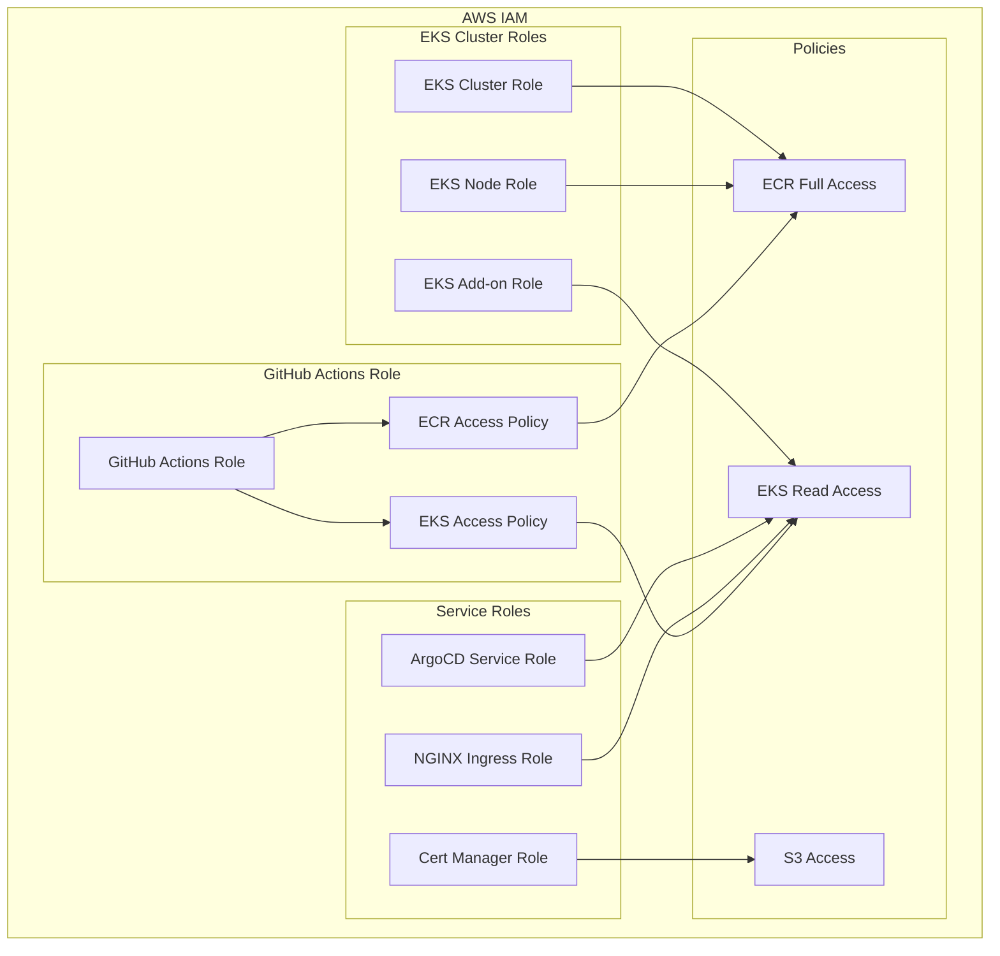
```mermaid
graph TB
    subgraph "AWS IAM"
        subgraph "EKS Cluster Roles"
            EKS_CLUSTER_ROLE[EKS Cluster Role]
            EKS_NODE_ROLE[EKS Node Role]
            EKS_ADDON_ROLE[EKS Add-on Role]
        end
        
        subgraph "Service Roles"
            ARGOCD_ROLE[ArgoCD Service Role]
            NGINX_ROLE[NGINX Ingress Role]
            CERT_ROLE[Cert Manager Role]
        end
        
        subgraph "GitHub Actions Role"
            GITHUB_ROLE[GitHub Actions Role]
            ECR_POLICY[ECR Access Policy]
            EKS_POLICY[EKS Access Policy]
        end
        
        subgraph "Policies"
            ECR_FULL_ACCESS[ECR Full Access]
            EKS_READ_ACCESS[EKS Read Access]
            S3_ACCESS[S3 Access]
        end
    end
    
    EKS_CLUSTER_ROLE --> ECR_FULL_ACCESS
    EKS_NODE_ROLE --> ECR_FULL_ACCESS
    EKS_ADDON_ROLE --> EKS_READ_ACCESS
    
    ARGOCD_ROLE --> EKS_READ_ACCESS
    NGINX_ROLE --> EKS_READ_ACCESS
    CERT_ROLE --> S3_ACCESS
    
    GITHUB_ROLE --> ECR_POLICY
    GITHUB_ROLE --> EKS_POLICY
    ECR_POLICY --> ECR_FULL_ACCESS
    EKS_POLICY --> EKS_READ_ACCESS
```

## Monitoring and Observability

### Observability Stack

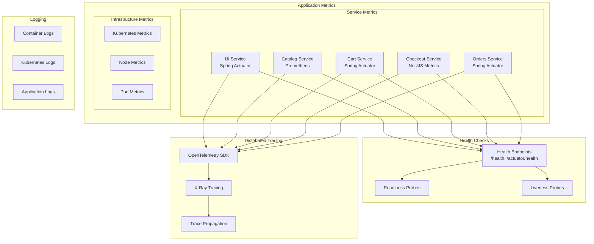
```mermaid
graph TB
    subgraph "Application Metrics"
        subgraph "Service Metrics"
            UI_METRICS[UI Service<br/>Spring Actuator]
            CAT_METRICS[Catalog Service<br/>Prometheus]
            CART_METRICS[Cart Service<br/>Spring Actuator]
            CHECK_METRICS[Checkout Service<br/>NestJS Metrics]
            ORD_METRICS[Orders Service<br/>Spring Actuator]
        end
        
        subgraph "Infrastructure Metrics"
            K8S_METRICS[Kubernetes Metrics]
            NODE_METRICS[Node Metrics]
            POD_METRICS[Pod Metrics]
        end
    end
    
    subgraph "Health Checks"
        HEALTH_ENDPOINTS[Health Endpoints<br/>/health, /actuator/health]
        READINESS[Readiness Probes]
        LIVENESS[Liveness Probes]
    end
    
    subgraph "Distributed Tracing"
        OTEL_SDK[OpenTelemetry SDK]
        XRAY_TRACING[X-Ray Tracing]
        TRACE_PROPAGATION[Trace Propagation]
    end
    
    subgraph "Logging"
        CONTAINER_LOGS[Container Logs]
        K8S_LOGS[Kubernetes Logs]
        APPLICATION_LOGS[Application Logs]
    end
    
    UI_METRICS --> HEALTH_ENDPOINTS
    CAT_METRICS --> HEALTH_ENDPOINTS
    CART_METRICS --> HEALTH_ENDPOINTS
    CHECK_METRICS --> HEALTH_ENDPOINTS
    ORD_METRICS --> HEALTH_ENDPOINTS
    
    HEALTH_ENDPOINTS --> READINESS
    HEALTH_ENDPOINTS --> LIVENESS
    
    UI_METRICS --> OTEL_SDK
    CAT_METRICS --> OTEL_SDK
    CART_METRICS --> OTEL_SDK
    CHECK_METRICS --> OTEL_SDK
    ORD_METRICS --> OTEL_SDK
    
    OTEL_SDK --> XRAY_TRACING
    XRAY_TRACING --> TRACE_PROPAGATION
```

### Monitoring Endpoints

```mermaid
graph TB
    subgraph "Monitoring Endpoints"
        subgraph "Java Services (UI, Cart, Orders)"
            JAVA_HEALTH[/actuator/health]
            JAVA_METRICS[/actuator/metrics]
            JAVA_PROMETHEUS[/actuator/prometheus]
            JAVA_INFO[/actuator/info]
        end
        
        subgraph "Go Service (Catalog)"
            GO_HEALTH[/health]
            GO_METRICS[/metrics]
            GO_TOPOLOGY[/topology]
        end
        
        subgraph "Node.js Service (Checkout)"
            NODE_HEALTH[/health]
            NODE_METRICS[/metrics]
            NODE_API[/api]
        end
        
        subgraph "Kubernetes Health"
            K8S_READY[Readiness Probe]
            K8S_LIVE[Liveness Probe]
            K8S_STARTUP[Startup Probe]
        end
    end
    
    JAVA_HEALTH --> K8S_READY
    GO_HEALTH --> K8S_READY
    NODE_HEALTH --> K8S_READY
    
    JAVA_METRICS --> K8S_LIVE
    GO_METRICS --> K8S_LIVE
    NODE_METRICS --> K8S_LIVE
```

## Data Flow

### Complete User Journey

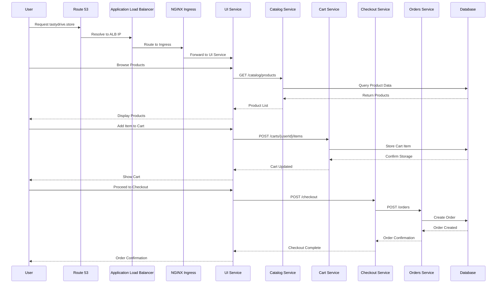
```mermaid
sequenceDiagram
    participant U as User
    participant DNS as Route 53
    participant ALB as Application Load Balancer
    participant NGINX as NGINX Ingress
    participant UI as UI Service
    participant CAT as Catalog Service
    participant CART as Cart Service
    participant CHECK as Checkout Service
    participant ORD as Orders Service
    participant DB as Database
    
    U->>DNS: Request tastydrive.store
    DNS->>ALB: Resolve to ALB IP
    ALB->>NGINX: Route to Ingress
    NGINX->>UI: Forward to UI Service
    
    U->>UI: Browse Products
    UI->>CAT: GET /catalog/products
    CAT->>DB: Query Product Data
    DB-->>CAT: Return Products
    CAT-->>UI: Product List
    UI-->>U: Display Products
    
    U->>UI: Add Item to Cart
    UI->>CART: POST /carts/{userId}/items
    CART->>DB: Store Cart Item
    DB-->>CART: Confirm Storage
    CART-->>UI: Cart Updated
    UI-->>U: Show Cart
    
    U->>UI: Proceed to Checkout
    UI->>CHECK: POST /checkout
    CHECK->>ORD: POST /orders
    ORD->>DB: Create Order
    DB-->>ORD: Order Created
    ORD-->>CHECK: Order Confirmation
    CHECK-->>UI: Checkout Complete
    UI-->>U: Order Confirmation
```

### Service Dependencies

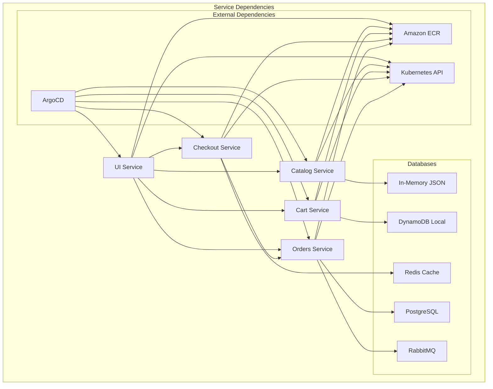
```mermaid
graph TB
    subgraph "Service Dependencies"
        UI[UI Service]
        CAT[Catalog Service]
        CART[Cart Service]
        CHECK[Checkout Service]
        ORD[Orders Service]
        
        subgraph "Databases"
            CAT_DB[In-Memory JSON]
            CART_DB[DynamoDB Local]
            CHECK_DB[Redis Cache]
            ORD_DB[PostgreSQL]
            ORD_MSG[RabbitMQ]
        end
        
        subgraph "External Dependencies"
            ECR[Amazon ECR]
            K8S[Kubernetes API]
            ARGOCD[ArgoCD]
        end
    end
    
    UI --> CAT
    UI --> CART
    UI --> CHECK
    UI --> ORD
    
    CHECK --> ORD
    
    CAT --> CAT_DB
    CART --> CART_DB
    CHECK --> CHECK_DB
    ORD --> ORD_DB
    ORD --> ORD_MSG
    
    UI --> ECR
    CAT --> ECR
    CART --> ECR
    CHECK --> ECR
    ORD --> ECR
    
    UI --> K8S
    CAT --> K8S
    CART --> K8S
    CHECK --> K8S
    ORD --> K8S
    
    ARGOCD --> UI
    ARGOCD --> CAT
    ARGOCD --> CART
    ARGOCD --> CHECK
    ARGOCD --> ORD
```

## Branching Strategy

### Dual Branch Architecture

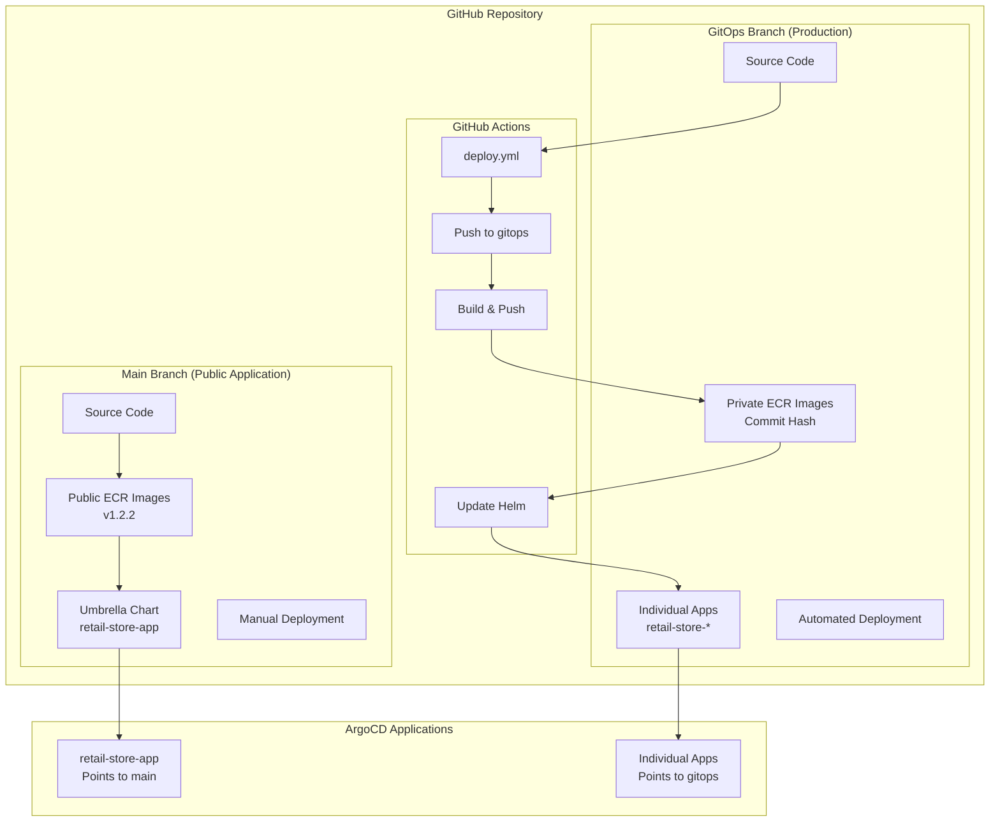
```mermaid
graph TB
    subgraph "GitHub Repository"
        subgraph "Main Branch (Public Application)"
            MAIN_CODE[Source Code]
            MAIN_PUBLIC[Public ECR Images<br/>v1.2.2]
            MAIN_UMBRELLA[Umbrella Chart<br/>retail-store-app]
            MAIN_MANUAL[Manual Deployment]
        end
        
        subgraph "GitOps Branch (Production)"
            GITOPS_CODE[Source Code]
            GITOPS_PRIVATE[Private ECR Images<br/>Commit Hash]
            GITOPS_INDIVIDUAL[Individual Apps<br/>retail-store-*]
            GITOPS_AUTO[Automated Deployment]
        end
        
        subgraph "GitHub Actions"
            WORKFLOW[deploy.yml]
            TRIGGER[Push to gitops]
            BUILD[Build & Push]
            UPDATE[Update Helm]
        end
    end
    
    subgraph "ArgoCD Applications"
        UMBRELLA_APP[retail-store-app<br/>Points to main]
        INDIVIDUAL_APPS[Individual Apps<br/>Points to gitops]
    end
    
    MAIN_CODE --> MAIN_PUBLIC
    MAIN_PUBLIC --> MAIN_UMBRELLA
    MAIN_UMBRELLA --> UMBRELLA_APP
    
    GITOPS_CODE --> WORKFLOW
    WORKFLOW --> TRIGGER
    TRIGGER --> BUILD
    BUILD --> GITOPS_PRIVATE
    GITOPS_PRIVATE --> UPDATE
    UPDATE --> GITOPS_INDIVIDUAL
    GITOPS_INDIVIDUAL --> INDIVIDUAL_APPS
```

### Branch Comparison

```mermaid
graph TB
    subgraph "Branch Comparison"
        subgraph "Main Branch Features"
            MAIN_FEATURES[✅ Public ECR Images<br/>✅ Manual Deployment<br/>✅ Umbrella Chart<br/>✅ Stable Versions<br/>✅ Demo Ready]
        end
        
        subgraph "GitOps Branch Features"
            GITOPS_FEATURES[✅ Private ECR Images<br/>✅ Automated Deployment<br/>✅ Individual Apps<br/>✅ Dynamic Versions<br/>✅ Production Ready]
        end
        
        subgraph "Shared Features"
            SHARED_FEATURES[✅ Same Source Code<br/>✅ Same Helm Charts<br/>✅ Same Infrastructure<br/>✅ Same ArgoCD<br/>✅ Same Monitoring]
        end
    end
    
    MAIN_FEATURES --> SHARED_FEATURES
    GITOPS_FEATURES --> SHARED_FEATURES
```

## Troubleshooting Guide

### Common Issues and Solutions

```mermaid
graph TB
    subgraph "Troubleshooting Flow"
        ISSUE[Issue Detected]
        
        subgraph "Image Issues"
            IMG_PULL[Image Pull Errors]
            IMG_NOT_FOUND[Image Not Found]
            IMG_PERMISSION[Permission Denied]
        end
        
        subgraph "Deployment Issues"
            DEPLOY_FAILED[Deployment Failed]
            POD_CRASH[Pod CrashLoopBackOff]
            RESOURCE_LIMIT[Resource Limits]
        end
        
        subgraph "Network Issues"
            NETWORK_ERROR[Network Connectivity]
            DNS_RESOLVE[DNS Resolution]
            SERVICE_UNAVAILABLE[Service Unavailable]
        end
        
        subgraph "ArgoCD Issues"
            SYNC_FAILED[Sync Failed]
            APP_OUT_OF_SYNC[Out of Sync]
            RESOURCE_CONFLICT[Resource Conflict]
        end
        
        subgraph "Solutions"
            CHECK_ECR[Check ECR Repository]
            CHECK_CREDENTIALS[Verify AWS Credentials]
            CHECK_BRANCH[Verify Branch Strategy]
            CHECK_LOGS[Review Application Logs]
            CHECK_RESOURCES[Check Resource Limits]
            MANUAL_SYNC[Manual ArgoCD Sync]
        end
    end
    
    ISSUE --> IMG_PULL
    ISSUE --> DEPLOY_FAILED
    ISSUE --> NETWORK_ERROR
    ISSUE --> SYNC_FAILED
    
    IMG_PULL --> CHECK_ECR
    IMG_PULL --> CHECK_CREDENTIALS
    IMG_PULL --> CHECK_BRANCH
    
    DEPLOY_FAILED --> CHECK_LOGS
    DEPLOY_FAILED --> CHECK_RESOURCES
    
    NETWORK_ERROR --> CHECK_LOGS
    NETWORK_ERROR --> SERVICE_UNAVAILABLE
    
    SYNC_FAILED --> MANUAL_SYNC
    SYNC_FAILED --> RESOURCE_CONFLICT
```

### Diagnostic Commands

```bash
# Check cluster status
kubectl get nodes
kubectl get pods -n retail-store
kubectl get svc -n retail-store

# Check ArgoCD status
kubectl get applications -n argocd
kubectl describe application retail-store-ui -n argocd

# Check application logs
kubectl logs -f deployment/retail-store-ui -n retail-store
kubectl logs -f deployment/retail-store-catalog -n retail-store

# Check ingress
kubectl get ingress -n retail-store
kubectl describe ingress retail-store-ui -n retail-store

# Check ECR images
aws ecr describe-repositories --region us-west-2
aws ecr list-images --repository-name retail-store-ui --region us-west-2

# Check GitHub Actions
gh run list --workflow=deploy.yml
gh run view <run-id>
```

## Conclusion

This retail store sample application demonstrates a comprehensive cloud-native architecture using modern DevOps practices. The combination of microservices, GitOps, infrastructure as code, and automated CI/CD pipelines provides a robust foundation for scalable, maintainable applications.

### Key Benefits

1. **Scalability**: Microservices architecture allows independent scaling
2. **Reliability**: GitOps ensures consistent deployments
3. **Security**: Multiple security layers and best practices
4. **Observability**: Comprehensive monitoring and logging
5. **Automation**: Fully automated CI/CD pipeline
6. **Flexibility**: Dual branch strategy for different use cases

### Best Practices Demonstrated

- Infrastructure as Code with Terraform
- GitOps with ArgoCD
- Container security best practices
- Automated testing and deployment
- Monitoring and observability
- Multi-language microservices
- Cloud-native design patterns

This architecture serves as an excellent reference for building production-ready, cloud-native applications on AWS EKS.
