# The Retail Store Architecture Story: A Journey from Code to Customer

## 📖 Table of Contents

1. [The Beginning: A Developer's Day](#the-beginning-a-developers-day)
2. [Chapter 1: The Code Journey](#chapter-1-the-code-journey)
3. [Chapter 2: The CI/CD Pipeline Adventure](#chapter-2-the-cicd-pipeline-adventure)
4. [Chapter 3: The GitOps Magic](#chapter-3-the-gitops-magic)
5. [Chapter 4: The Infrastructure Foundation](#chapter-4-the-infrastructure-foundation)
6. [Chapter 5: The Microservices Orchestra](#chapter-5-the-microservices-orchestra)
7. [Chapter 6: The Customer's Shopping Journey](#chapter-6-the-customers-shopping-journey)
8. [Chapter 7: The Monitoring and Healing](#chapter-7-the-monitoring-and-healing)
9. [Epilogue: The Continuous Cycle](#epilogue-the-continuous-cycle)

---

## The Beginning: A Developer's Day

Meet **Sarah**, a software developer working on the Retail Store application. It's Monday morning, and she's about to add a new feature to the catalog service. Little does she know, her simple code change will trigger an incredible journey through a sophisticated cloud-native architecture.

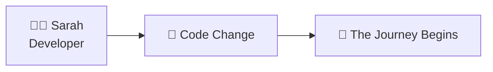

**"Let me add a new product category filter,"** Sarah thinks as she opens her editor. This innocent decision will set in motion a beautifully orchestrated chain of events involving containers, Kubernetes, AWS cloud services, and automated deployment pipelines.

---

## Chapter 1: The Code Journey

### 🌅 The Dawn of Development

Sarah begins her day by checking out the **gitops branch** of the retail store repository. She navigates to the `src/catalog/` directory, where the Go-based catalog service lives.

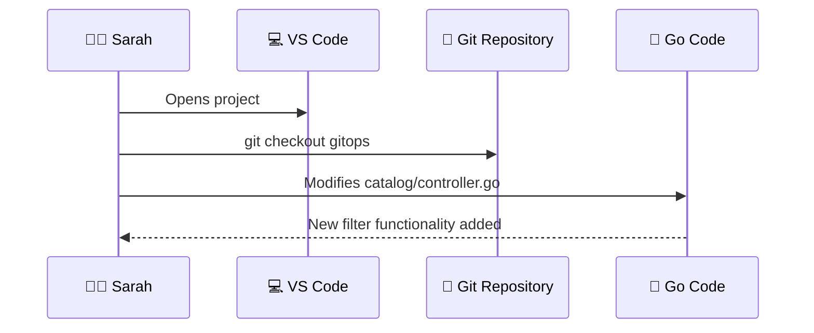

**The Code Change:**
```go
// In src/catalog/controller/controller.go
func (c *Controller) GetProductsByCategory(ctx *gin.Context) {
    category := ctx.Query("category")
    // Sarah's new filtering logic here
}
```

**Sarah's Monologue:** *"This is just a small change to add category filtering. But I know this will automatically trigger our entire deployment pipeline. Let me commit this change and watch the magic happen!"*

She commits her code:
```bash
git add .
git commit -m "feat: Add category filtering to catalog service"
git push origin gitops
```

### 📁 The Repository Structure Tale

The moment Sarah's code lands in the repository, it joins a well-organized family of microservices:

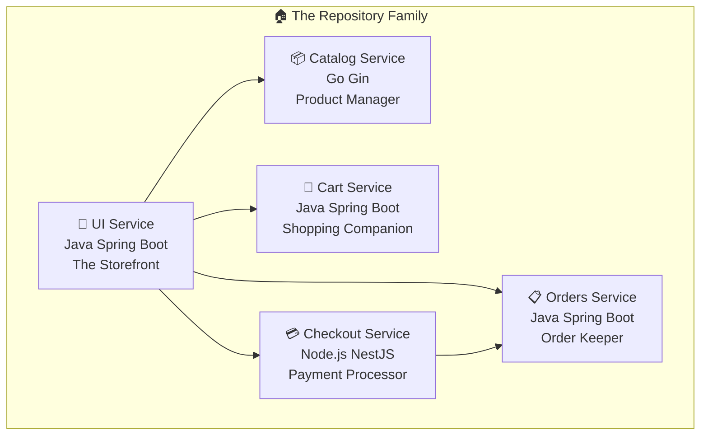

Each service has its own personality:
- **UI Service**: *"I'm the face of the operation! I make things beautiful for customers."*
- **Catalog Service**: *"I know everything about our products! Sarah just made me smarter."*
- **Cart Service**: *"I never forget what customers want to buy!"*
- **Checkout Service**: *"I make the magic happen when money changes hands!"*
- **Orders Service**: *"I keep track of everything and tell everyone what happened!"*

---

## Chapter 2: The CI/CD Pipeline Adventure

### 🚨 The GitHub Actions Awakening

The moment Sarah's code hits the gitops branch, **GitHub Actions** springs into action like a digital detective:

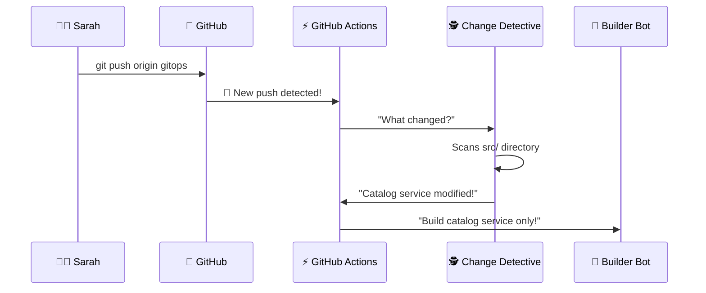

### 🔍 The Change Detection Story

The **Change Detective** (our smart GitHub Actions workflow) performs its investigation:

```bash
# The Detective's Thought Process:
"Let me see what Sarah changed..."
📁 src/ui/ - "No changes here, UI is safe"
📁 src/catalog/ - "Aha! Changes detected here!" ✅
📁 src/cart/ - "All quiet on this front"
📁 src/checkout/ - "Nothing to see here"
📁 src/orders/ - "All good"

"Verdict: Only catalog service needs rebuilding!"
```

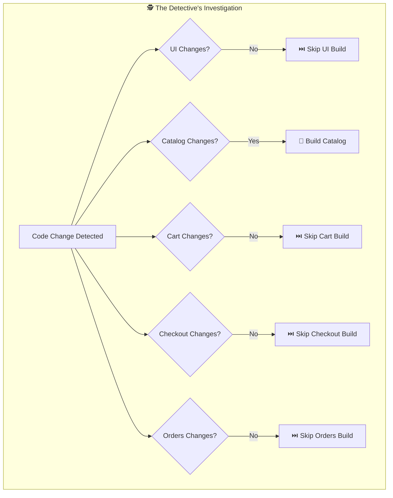

### 🏗️ The Build Factory Adventure

Now the **Builder Bot** takes over for the catalog service:

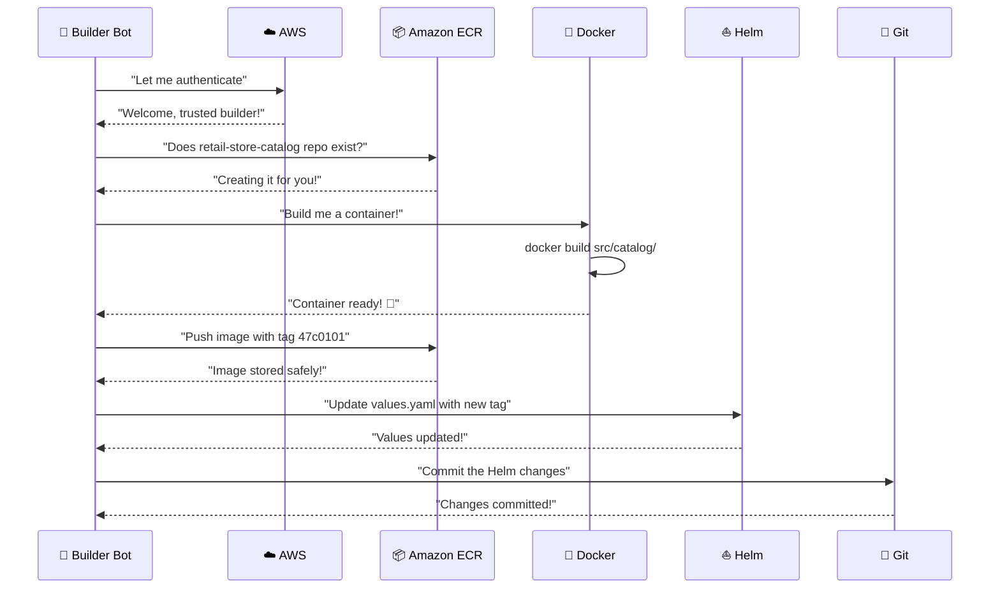

**Builder Bot's Inner Monologue:**
*"Sarah's code change means I need to:*
1. *Take her Go code and wrap it in a container*
2. *Give it a unique name (the commit hash: 47c0101)*
3. *Store it safely in AWS ECR*
4. *Tell the Helm chart about the new version*
5. *Commit these changes back to git*
*All done automatically - Sarah doesn't need to worry about any of this!"*

### 🏷️ The Image Tagging Ceremony

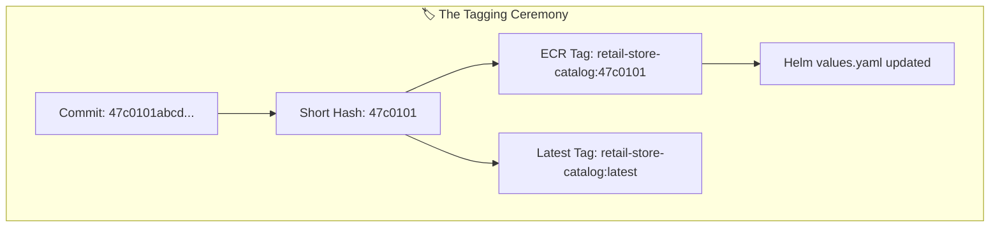

---

## Chapter 3: The GitOps Magic

### 🧙‍♂️ ArgoCD: The GitOps Wizard

While the Builder Bot was working, **ArgoCD** (our GitOps wizard) was watching the repository with magical eyes:

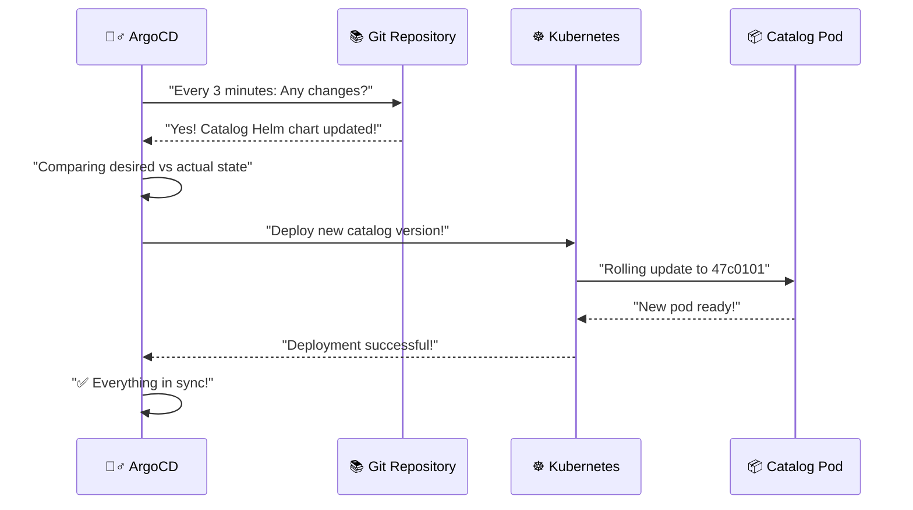

**ArgoCD's Magical Thoughts:**
*"I am the guardian of the desired state. I continuously watch the gitops branch and ensure that what's running in Kubernetes matches exactly what the developers intended. When I see Builder Bot has updated the catalog service to version 47c0101, I spring into action!"*

### 🌊 The Sync Wave Choreography

ArgoCD orchestrates deployments using **sync waves** - like a conductor directing an orchestra:

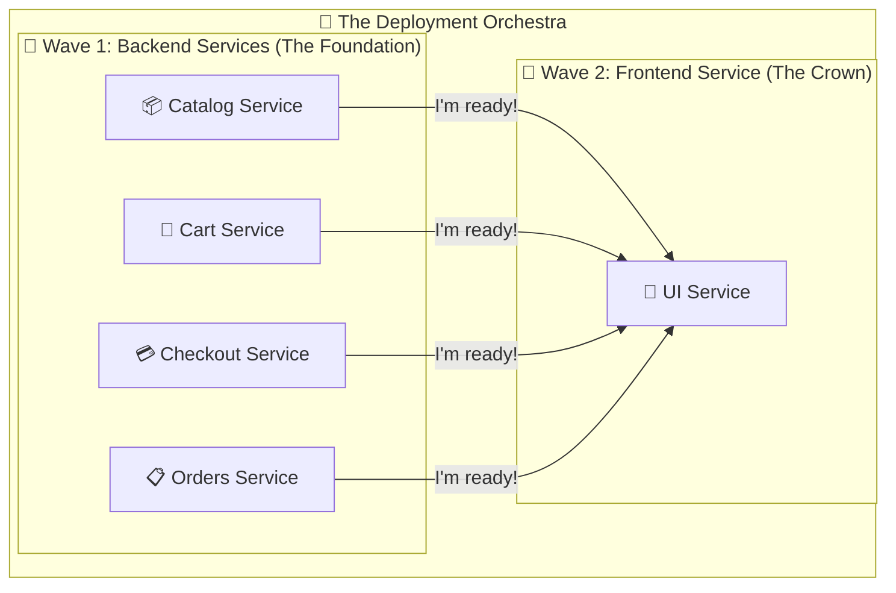

**The Sync Wave Story:**
1. **Wave 1**: *"First, let's make sure all the backend services are healthy"*
2. **Wave 2**: *"Now that the backend is solid, let's update the frontend"*

This ensures the UI never tries to connect to services that aren't ready yet!

### 🎯 The Individual Application Strategy

ArgoCD manages each service as a separate application:

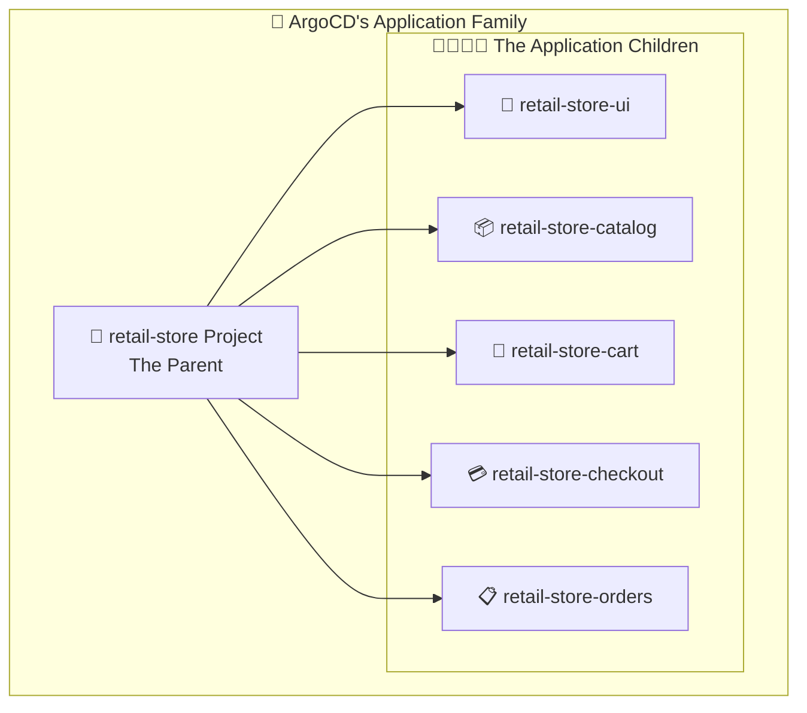

**Each Application's Personality:**
- *"I am independent but part of the family"*
- *"I can be updated without affecting my siblings"*
- *"I point to my own Helm chart in the gitops branch"*
- *"I have my own sync policy and health checks"*

---

## Chapter 4: The Infrastructure Foundation

### 🏗️ Terraform: The Infrastructure Architect

Before any applications can run, **Terraform** (our infrastructure architect) builds the foundation:

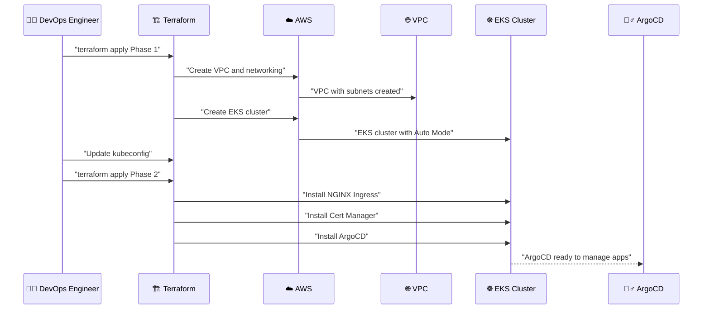

### 🌐 The VPC Neighborhood Story

Terraform creates a virtual neighborhood in AWS:

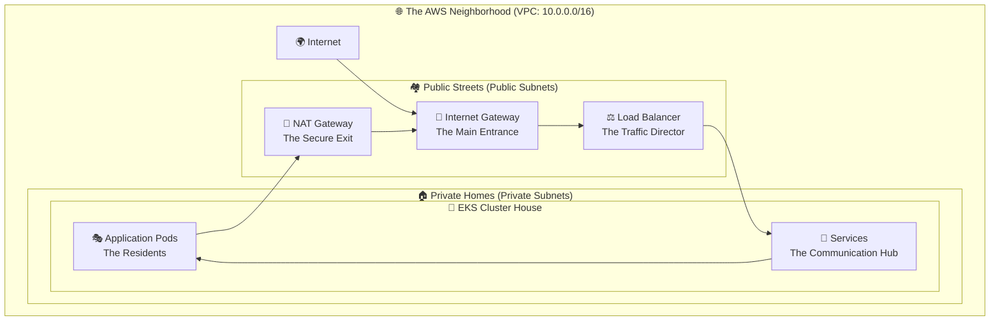

**The Neighborhood Rules:**
- *"Public subnets are where visitors (internet traffic) can enter"*
- *"Private subnets are where our applications live safely"*
- *"The Load Balancer is the friendly traffic director"*
- *"NAT Gateway lets our apps talk to the outside world securely"*

### ☸️ EKS Auto Mode: The Self-Managing Apartment Complex

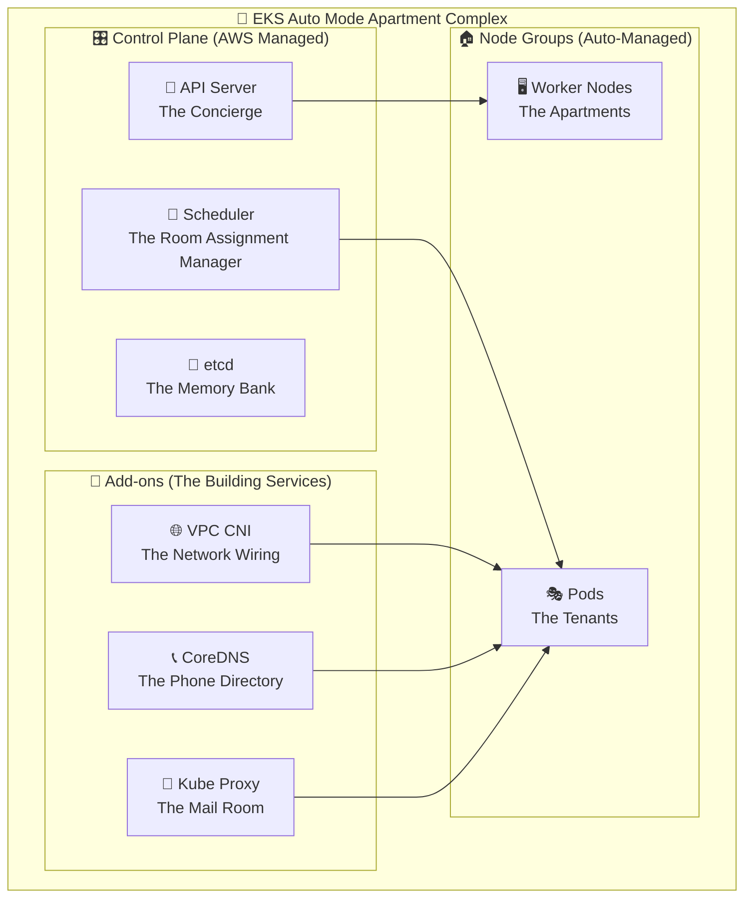

**EKS Auto Mode's Promise:**
*"Don't worry about managing nodes, networking, or add-ons. I'll handle all the infrastructure complexity. You just focus on your applications!"*

---

## Chapter 5: The Microservices Orchestra

### 🎼 The Service Symphony

Now that Sarah's catalog service has been deployed, let's see how all the microservices work together like a symphony orchestra:

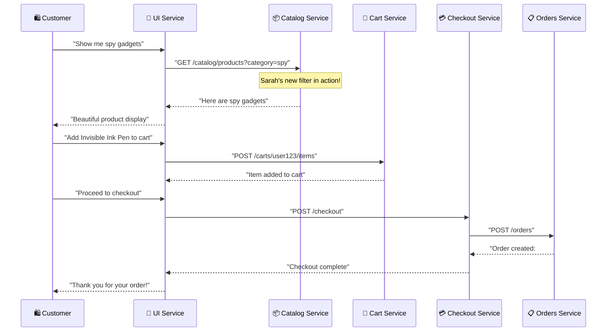

### 🏠 Each Service's Home and Personality

Let's visit each service in their Kubernetes neighborhood:

#### 🎨 UI Service - The Charming Host
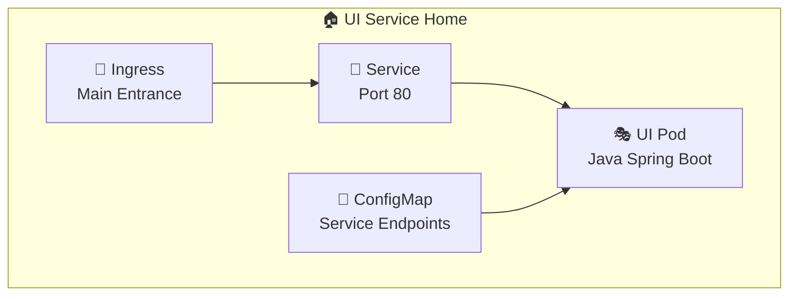

**UI Service's Monologue:**
*"Welcome to our store! I'm the friendly face that customers see. I know where all my friends live (thanks to my ConfigMap), so when customers want to see products, I ask Catalog. When they want to add items to cart, I talk to Cart. I'm the conductor of the customer experience orchestra!"*

#### 📦 Catalog Service - The Product Expert
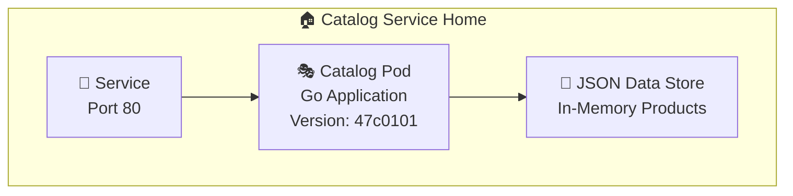

**Catalog Service's Monologue:**
*"I'm the product encyclopedia! Thanks to Sarah's recent update, I can now filter products by category. I keep all product information in my memory (JSON files) and I'm super fast at answering questions about our spy gadgets, tools, and accessories. I speak HTTP and love responding to GET requests!"*

#### 🛒 Cart Service - The Memory Keeper
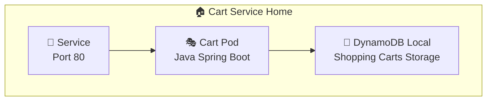

**Cart Service's Monologue:**
*"I never forget! Every item customers add to their cart, I remember in my DynamoDB storage. I'm persistent and reliable. Even if UI service restarts, I still remember what customers wanted to buy. I'm the shopping companion that never forgets!"*

#### 💳 Checkout Service - The Deal Maker
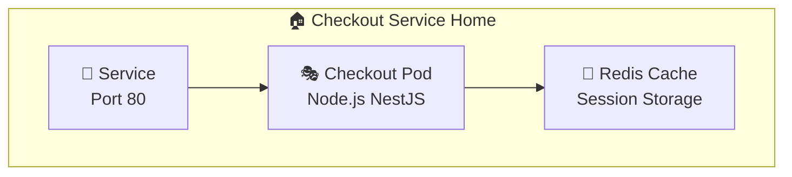

**Checkout Service's Monologue:**
*"I make the magic happen! When customers are ready to buy, I orchestrate the entire process. I talk to Orders service to create the order, handle shipping calculations, and make sure everything goes smoothly. I use Redis to keep track of checkout sessions. I'm the deal maker!"*

#### 📋 Orders Service - The Record Keeper
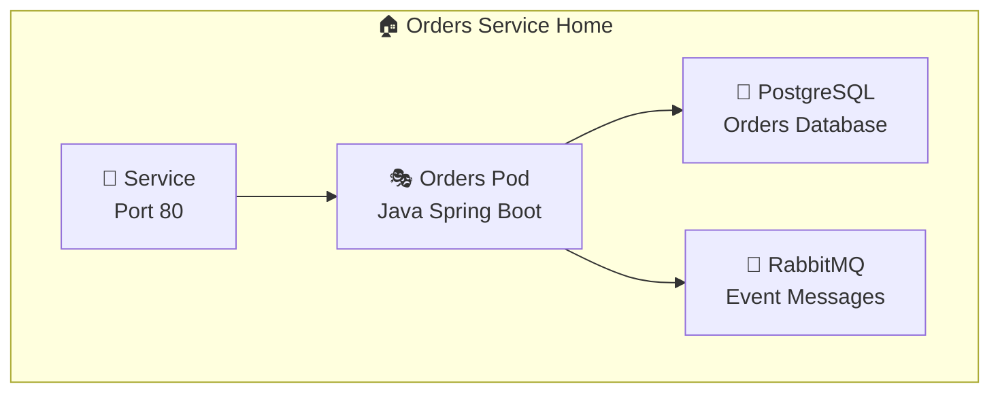

**Orders Service's Monologue:**
*"I'm the official record keeper! Every order gets stored in my PostgreSQL database with a unique ID. I also publish events to RabbitMQ so other services know when orders are created, updated, or completed. I'm the source of truth for all order information!"*

### 🌐 The Network Neighborhood

All these services live in the same Kubernetes namespace and can talk to each other:

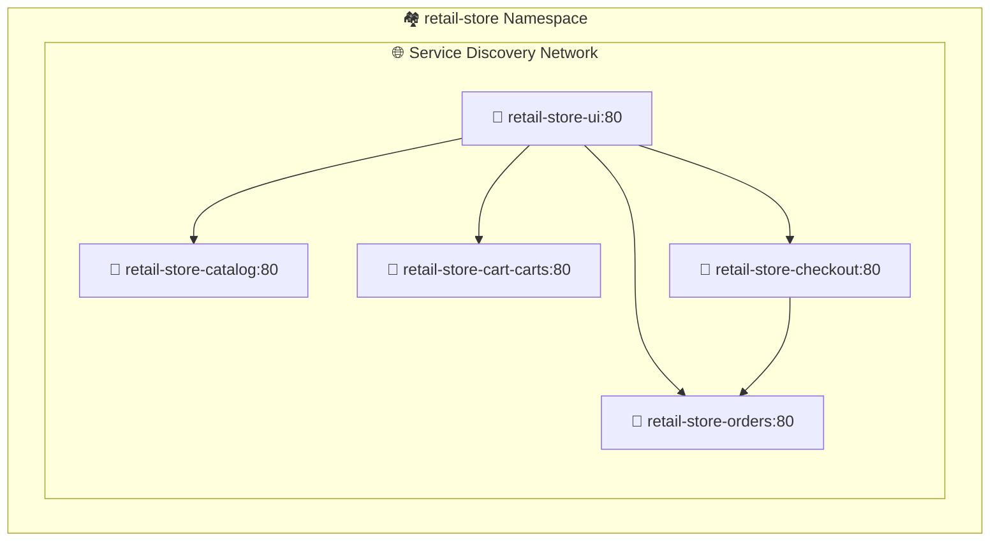

**The Network's Magic:**
*"Thanks to Kubernetes DNS, services can find each other by name. When UI wants to talk to Catalog, it just calls 'http://retail-store-catalog:80' and Kubernetes routes the request to the right pod!"*

---

## Chapter 6: The Customer's Shopping Journey

### 🛍️ Meet Alex: The Customer

Let's follow **Alex**, a customer who wants to buy some spy gadgets, and see how their journey triggers our entire architecture:

```mermaid
journey
    title Alex's Shopping Journey
    section Discovery
      Opens website: 5: Alex
      Views products: 4: Alex, UI, Catalog
      Filters by category: 5: Alex, UI, Catalog
    section Shopping
      Adds items to cart: 4: Alex, UI, Cart
      Views cart: 3: Alex, UI, Cart
      Modifies quantities: 4: Alex, UI, Cart
    section Purchase
      Proceeds to checkout: 3: Alex, UI, Checkout
      Completes order: 5: Alex, UI, Checkout, Orders
      Receives confirmation: 5: Alex, UI, Orders
```

### 🌍 The Journey Begins: From Browser to Cloud

```mermaid
sequenceDiagram
    participant Alex as 🛍️ Alex's Browser
    participant DNS as 🌐 Route 53/DNS
    participant ALB as ⚖️ AWS Load Balancer
    participant NGINX as 🔀 NGINX Ingress
    participant UI as 🎨 UI Service
    
    Alex->>DNS: "tastydrive.store"
    DNS-->>Alex: "Points to Load Balancer IP"
    Alex->>ALB: "HTTPS request"
    ALB->>NGINX: "Routes to Kubernetes"
    NGINX->>UI: "Forwards to UI service"
    UI-->>NGINX: "Retail store homepage"
    NGINX-->>ALB: "Response with HTML"
    ALB-->>Alex: "Beautiful storefront appears!"
```

**Alex's Experience:**
*"Wow, this website loaded fast! I can see spy gadgets, tools, and accessories. Let me look for that invisible ink pen I need for my secret mission... I mean, for my weekend project!"*

### 📦 Product Discovery: Sarah's Feature in Action

```mermaid
sequenceDiagram
    participant Alex as 🛍️ Alex
    participant UI as 🎨 UI Service
    participant Catalog as 📦 Catalog Service (v47c0101)
    participant Data as 💾 Product Data
    
    Alex->>UI: "Show spy gadgets category"
    UI->>Catalog: "GET /catalog/products?category=spy"
    Note over Catalog: Sarah's new filter code!
    Catalog->>Data: "Filter products by category=spy"
    Data-->>Catalog: "Invisible Ink Pen, Spy Camera, etc."
    Catalog-->>UI: "JSON response with spy products"
    UI-->>Alex: "Filtered product list displayed"
```

**The Magic Moment:**
*Sarah's code change this morning is now serving Alex's request! The new category filter that Sarah added to the catalog service is working perfectly.*

### 🛒 Shopping Cart Magic

```mermaid
sequenceDiagram
    participant Alex as 🛍️ Alex
    participant UI as 🎨 UI Service
    participant Cart as 🛒 Cart Service
    participant DynamoDB as 💾 DynamoDB Local
    
    Alex->>UI: "Add Invisible Ink Pen to cart"
    UI->>Cart: "POST /carts/alex-session-123/items"
    Note over Cart: Processes add to cart request
    Cart->>DynamoDB: "Store cart item"
    DynamoDB-->>Cart: "Item stored successfully"
    Cart-->>UI: "Cart updated - 1 item"
    UI-->>Alex: "✅ Added to cart (Cart: 1 item)"
    
    Alex->>UI: "View my cart"
    UI->>Cart: "GET /carts/alex-session-123"
    Cart->>DynamoDB: "Retrieve cart items"
    DynamoDB-->>Cart: "Invisible Ink Pen - $12.99"
    Cart-->>UI: "Cart contents"
    UI-->>Alex: "Your cart: Invisible Ink Pen - $12.99"
```

### 💳 The Checkout Orchestra

```mermaid
sequenceDiagram
    participant Alex as 🛍️ Alex
    participant UI as 🎨 UI Service
    participant Checkout as 💳 Checkout Service
    participant Orders as 📋 Orders Service
    participant PostgreSQL as 💾 PostgreSQL
    participant RabbitMQ as 📨 RabbitMQ
    
    Alex->>UI: "Proceed to checkout"
    UI->>Checkout: "POST /checkout (cart contents)"
    
    Note over Checkout: Orchestrates the checkout process
    Checkout->>Orders: "POST /orders (create order)"
    Orders->>PostgreSQL: "INSERT order record"
    PostgreSQL-->>Orders: "Order #12345 created"
    Orders->>RabbitMQ: "Publish OrderCreated event"
    RabbitMQ-->>Orders: "Event published"
    Orders-->>Checkout: "Order #12345 confirmation"
    
    Checkout-->>UI: "Checkout successful - Order #12345"
    UI-->>Alex: "🎉 Thank you! Order #12345 confirmed"
```

**Alex's Happy Ending:**
*"Excellent! I got my invisible ink pen and the order number #12345. This was such a smooth experience. I love how fast and reliable this store is!"*

---

## Chapter 7: The Monitoring and Healing

### 👀 The Watchers: Monitoring Everything

While Alex was shopping, an army of monitoring systems was watching over the entire infrastructure:

```mermaid
graph TB
    subgraph "👀 The Monitoring Army"
        subgraph "🏥 Health Checks"
            K8S_HEALTH[☸️ Kubernetes Health Probes]
            APP_HEALTH[💊 Application Health Endpoints]
            LOAD_HEALTH[⚖️ Load Balancer Health]
        end
        
        subgraph "📊 Metrics Collection"
            PROMETHEUS[📈 Prometheus Metrics]
            ACTUATOR[⚙️ Spring Boot Actuator]
            GO_METRICS[📊 Go Metrics]
            NODE_METRICS[📋 Node.js Metrics]
        end
        
        subgraph "🔍 Observability"
            LOGS[📜 Container Logs]
            TRACES[🔗 Distributed Tracing]
            ALERTS[🚨 Alert Manager]
        end
    end
```

### 🏥 The Healing Powers

When something goes wrong, Kubernetes has self-healing superpowers:

```mermaid
sequenceDiagram
    participant Monitor as 👀 Kubernetes Monitor
    participant Pod as 🎭 Catalog Pod
    participant Deployment as 🚀 Deployment Controller
    participant NewPod as 🎭 New Catalog Pod
    participant LoadBalancer as ⚖️ Service Load Balancer
    
    Monitor->>Pod: "Health check /health"
    Pod-->>Monitor: "❌ No response (pod crashed)"
    Monitor->>Deployment: "🚨 Pod is unhealthy!"
    Deployment->>Pod: "💀 Terminate unhealthy pod"
    Deployment->>NewPod: "🎭 Create new pod"
    NewPod->>NewPod: "Starting up..."
    NewPod-->>Monitor: "✅ /health returns OK"
    Monitor->>LoadBalancer: "Route traffic to new pod"
    
    Note over Monitor,LoadBalancer: Zero downtime healing!
```

**The Self-Healing Story:**
*"If the catalog service crashes while Alex is shopping, Kubernetes immediately detects this and creates a new healthy pod. Alex never notices because the load balancer routes traffic only to healthy pods. The healing happens faster than Alex can click refresh!"*

### 🔄 ArgoCD: The Configuration Guardian

```mermaid
sequenceDiagram
    participant ArgoCD as 🧙‍♂️ ArgoCD
    participant Git as 📚 Git Repository
    participant K8s as ☸️ Kubernetes
    participant Alert as 🚨 Alert System
    
    loop Every 3 minutes
        ArgoCD->>Git: "Check for changes"
        ArgoCD->>K8s: "Check current state"
        ArgoCD->>ArgoCD: "Compare desired vs actual"
        
        alt Configuration drift detected
            ArgoCD->>Alert: "🚨 Configuration drift!"
            ArgoCD->>K8s: "Sync to desired state"
            K8s-->>ArgoCD: "State corrected"
        else Everything in sync
            ArgoCD->>ArgoCD: "✅ All good"
        end
    end
```

**ArgoCD's Vigilance:**
*"I never sleep! I constantly ensure that what's running matches exactly what's in the git repository. If someone manually changes something in Kubernetes, I detect it and fix it. Git is the single source of truth!"*

---

## Chapter 8: The Security Fortress

### 🏰 The Multi-Layered Defense

Our retail store is protected by multiple layers of security:

```mermaid
graph TB
    subgraph "🏰 The Security Fortress"
        subgraph "🌐 Network Security"
            VPC_ISOLATION[🏠 VPC Isolation]
            PRIVATE_SUBNETS[🔒 Private Subnets]
            SECURITY_GROUPS[🛡️ Security Groups]
            NACL[🚧 Network ACLs]
        end
        
        subgraph "🔐 Application Security"
            NON_ROOT[👤 Non-root Containers]
            READ_ONLY[📖 Read-only Filesystems]
            CAPABILITIES[⚡ Dropped Capabilities]
            SECRETS[🔑 Kubernetes Secrets]
        end
        
        subgraph "🔍 Access Control"
            RBAC[👥 RBAC]
            SERVICE_ACCOUNTS[🤖 Service Accounts]
            IAM_ROLES[🎭 IAM Roles]
            OIDC[🔗 OIDC Provider]
        end
        
        subgraph "🔒 Encryption"
            TLS_CERTS[📜 TLS Certificates]
            KMS_ENCRYPTION[🔐 KMS Encryption]
            SECRETS_ENCRYPTION[🔑 Secrets Encryption]
        end
    end
```

### 🛡️ The Container Security Story

Each container runs with minimal privileges:

```yaml
# Security Context for UI Service
securityContext:
  capabilities:
    drop:
      - ALL          # "I give up all special powers"
    add:
      - NET_BIND_SERVICE  # "Except the power to bind to port 80"
  readOnlyRootFilesystem: true  # "My filesystem is read-only"
  runAsNonRoot: true            # "I don't run as root"
  runAsUser: 1000              # "I run as user 1000"
```

**Container's Security Pledge:**
*"I promise to run with minimal privileges. I can't write to my filesystem (except /tmp), I can't run as root, and I only have the bare minimum capabilities needed to do my job. If someone tries to hack me, they can't do much damage!"*

---

## Epilogue: The Continuous Cycle

### 🔄 The Never-Ending Story

As we reach the end of our story, we realize this is actually a never-ending cycle:

```mermaid
graph LR
    subgraph "🔄 The Continuous Cycle"
        DEVELOP[👩‍💻 Develop]
        COMMIT[📝 Commit]
        BUILD[🔨 Build]
        DEPLOY[🚀 Deploy]
        MONITOR[👀 Monitor]
        FEEDBACK[💭 Feedback]
        
        DEVELOP --> COMMIT
        COMMIT --> BUILD
        BUILD --> DEPLOY
        DEPLOY --> MONITOR
        MONITOR --> FEEDBACK
        FEEDBACK --> DEVELOP
    end
```

### 🌅 Tomorrow's Story

**Sarah's Tomorrow:**
*"It's Tuesday morning, and I just got feedback that customers love the new category filter I added yesterday. Now I want to add a search feature to the catalog service. Let me write some code..."*

And the cycle begins again! 🎭

### 📈 The Growing Story

As the application grows, new chapters will be added:
- **Chapter 9**: The Multi-Region Adventure
- **Chapter 10**: The Machine Learning Enhancement
- **Chapter 11**: The Performance Optimization Quest
- **Chapter 12**: The Security Hardening Mission

### 🎊 The Moral of the Story

**The Power of Automation:**
From Sarah's simple code change to Alex's shopping experience, everything happened automatically. No manual deployments, no infrastructure management, no service restarts - just pure, automated magic.

**The Beauty of Cloud-Native:**
- **Resilient**: If something breaks, it heals itself
- **Scalable**: If traffic increases, it scales automatically
- **Secure**: Multiple layers protect against threats
- **Observable**: Everything is monitored and traceable
- **Maintainable**: Changes are safe and reversible

**The Human Element:**
Despite all the automation and technology, at the heart of this story are people:
- **Sarah** writing code to solve real problems
- **Alex** having a delightful shopping experience
- **DevOps Engineers** building the platform that makes it all possible

### 🚀 The End (Which is Really a Beginning)

And so, our retail store continues to serve customers, heal itself when needed, and evolve with each commit. It's a living, breathing system that demonstrates the power of modern cloud-native architecture.

**Every day, the story continues...**

*Sarah writes code → GitHub Actions builds → ArgoCD deploys → Customers shop → Metrics flow → Insights emerge → New features planned...*

**The cycle of innovation never stops!** 🎉

---

*"In the world of cloud-native applications, every line of code is a new adventure, every deployment is a new chapter, and every customer interaction is proof that the magic works."*

**~ The End of Chapter 1, The Beginning of Forever ~**
