# Environment Management in Retail Store Sample App

## Table of Contents

1. [Overview](#overview)
2. [Environment Configuration Strategy](#environment-configuration-strategy)
3. [Service-Specific Environment Management](#service-specific-environment-management)
4. [Helm Chart Configuration](#helm-chart-configuration)
5. [ConfigMap Management](#configmap-management)
6. [Environment Variables Hierarchy](#environment-variables-hierarchy)
7. [Multi-Environment Support](#multi-environment-support)
8. [Configuration Security](#configuration-security)
9. [Dynamic Configuration](#dynamic-configuration)
10. [Best Practices](#best-practices)
11. [Troubleshooting](#troubleshooting)

## Overview

The Retail Store Sample App implements a comprehensive environment management strategy that supports multiple deployment scenarios, from local development to production environments. The configuration system uses a layered approach with application defaults, environment-specific overrides, and Kubernetes ConfigMaps.

### Key Features

- **Multi-language Support**: Java Spring Boot, Go, Node.js/TypeScript configurations
- **Layered Configuration**: Application defaults → Environment profiles → ConfigMaps → Environment variables
- **Helm-based Management**: Values-driven configuration through Helm charts
- **Service Discovery**: Dynamic endpoint configuration for inter-service communication
- **Persistence Flexibility**: Support for in-memory, database, and cloud storage backends
- **Security**: Separation of secrets and configuration

## Environment Configuration Strategy

### Configuration Layers

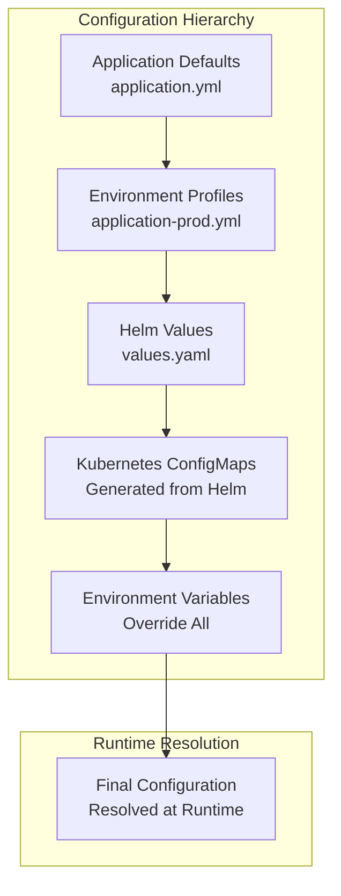

### Configuration Sources Priority

1. **Environment Variables** (Highest Priority)
2. **Kubernetes ConfigMaps**
3. **Helm Chart Values**
4. **Spring Profiles** (application-{profile}.yml)
5. **Application Defaults** (application.yml) (Lowest Priority)

## Service-Specific Environment Management

### UI Service (Java Spring Boot)

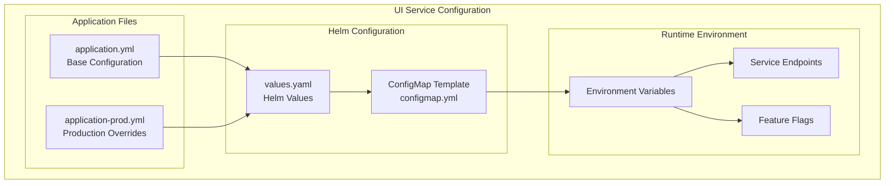

#### UI Service Environment Variables

| Variable | Description | Default | Helm Path |
|----------|-------------|---------|-----------|
| `RETAIL_UI_THEME` | UI theme selection | `default` | `app.theme` |
| `RETAIL_UI_ENDPOINTS_CATALOG` | Catalog service URL | - | `app.endpoints.catalog` |
| `RETAIL_UI_ENDPOINTS_CARTS` | Cart service URL | - | `app.endpoints.carts` |
| `RETAIL_UI_ENDPOINTS_CHECKOUT` | Checkout service URL | - | `app.endpoints.checkout` |
| `RETAIL_UI_ENDPOINTS_ORDERS` | Orders service URL | - | `app.endpoints.orders` |
| `RETAIL_UI_CHAT_ENABLED` | Enable AI chat feature | `false` | `app.chat.enabled` |
| `RETAIL_UI_CHAT_PROVIDER` | Chat provider (openai/bedrock) | - | `app.chat.provider` |

#### UI Configuration Flow

```yaml
# application.yml (Base)
retail:
  ui:
    theme: default
    endpoints:
      catalog: # http://localhost:8081
      carts: # http://localhost:8082
    chat:
      enabled: false
```

```yaml
# values.yaml (Helm)
app:
  theme: default
  endpoints:
    catalog: http://retail-store-catalog:80
    carts: http://retail-store-cart-carts:80
  chat:
    enabled: false
```

```yaml
# ConfigMap (Generated)
apiVersion: v1
kind: ConfigMap
data:
  RETAIL_UI_ENDPOINTS_CATALOG: http://retail-store-catalog:80
  RETAIL_UI_ENDPOINTS_CARTS: http://retail-store-cart-carts:80
```

### Catalog Service (Go)

```mermaid
graph TB
    subgraph "Catalog Service Configuration"
        subgraph "Go Configuration"
            CAT_CONFIG[config.go<br/>Struct Definitions]
            CAT_ENV[Environment Processing<br/>envconfig.Process()]
        end
        
        subgraph "Persistence Options"
            CAT_MEMORY[In-Memory Storage]
            CAT_MYSQL[MySQL Database]
        end
        
        subgraph "Configuration Variables"
            CAT_PROVIDER[RETAIL_CATALOG_PERSISTENCE_PROVIDER]
            CAT_ENDPOINT[RETAIL_CATALOG_PERSISTENCE_ENDPOINT]
            CAT_DB_NAME[RETAIL_CATALOG_PERSISTENCE_DB_NAME]
            CAT_USER[RETAIL_CATALOG_PERSISTENCE_USER]
            CAT_PASSWORD[RETAIL_CATALOG_PERSISTENCE_PASSWORD]
        end
    end
    
    CAT_CONFIG --> CAT_ENV
    CAT_ENV --> CAT_PROVIDER
    CAT_PROVIDER --> CAT_MEMORY
    CAT_PROVIDER --> CAT_MYSQL
    CAT_MYSQL --> CAT_ENDPOINT
    CAT_MYSQL --> CAT_DB_NAME
    CAT_MYSQL --> CAT_USER
    CAT_MYSQL --> CAT_PASSWORD
```

#### Catalog Service Environment Variables

| Variable | Description | Default | Type |
|----------|-------------|---------|------|
| `PORT` | Service port | `8080` | int |
| `RETAIL_CATALOG_PERSISTENCE_PROVIDER` | Storage backend | `in-memory` | string |
| `RETAIL_CATALOG_PERSISTENCE_ENDPOINT` | Database endpoint | - | string |
| `RETAIL_CATALOG_PERSISTENCE_DB_NAME` | Database name | `catalogdb` | string |
| `RETAIL_CATALOG_PERSISTENCE_USER` | Database user | `catalog_user` | string |
| `RETAIL_CATALOG_PERSISTENCE_PASSWORD` | Database password | - | string |
| `RETAIL_CATALOG_PERSISTENCE_CONNECT_TIMEOUT` | Connection timeout | `5` | int |

#### Catalog Configuration Code

```go
// config.go
type AppConfiguration struct {
    Port     int `env:"PORT,default=8080"`
    Database DatabaseConfiguration
}

type DatabaseConfiguration struct {
    Type           string `env:"RETAIL_CATALOG_PERSISTENCE_PROVIDER,default=in-memory"`
    Endpoint       string `env:"RETAIL_CATALOG_PERSISTENCE_ENDPOINT"`
    Name           string `env:"RETAIL_CATALOG_PERSISTENCE_DB_NAME,default=catalogdb"`
    User           string `env:"RETAIL_CATALOG_PERSISTENCE_USER,default=catalog_user"`
    Password       string `env:"RETAIL_CATALOG_PERSISTENCE_PASSWORD"`
    ConnectTimeout int    `env:"RETAIL_CATALOG_PERSISTENCE_CONNECT_TIMEOUT,default=5"`
}
```

### Cart Service (Java Spring Boot)

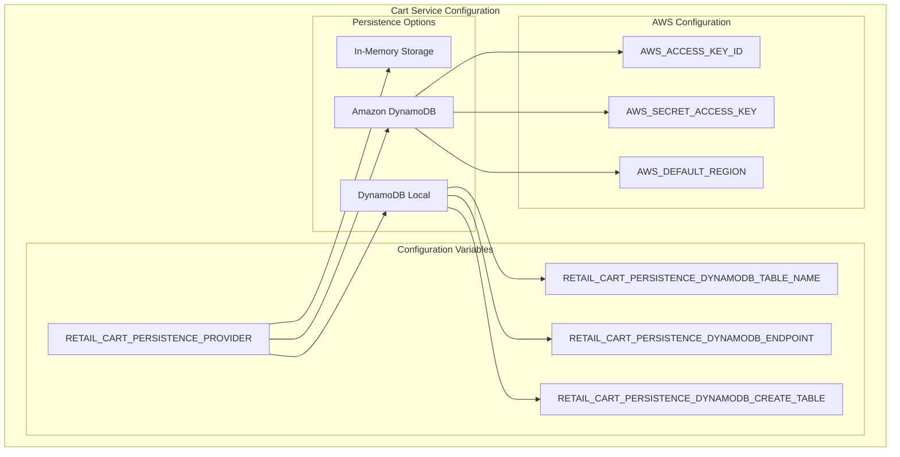

#### Cart Service Environment Variables

| Variable | Description | Default | Helm Path |
|----------|-------------|---------|-----------|
| `RETAIL_CART_PERSISTENCE_PROVIDER` | Storage backend | `in-memory` | `app.persistence.provider` |
| `RETAIL_CART_PERSISTENCE_DYNAMODB_TABLE_NAME` | DynamoDB table | `Items` | `app.persistence.dynamodb.tableName` |
| `RETAIL_CART_PERSISTENCE_DYNAMODB_ENDPOINT` | DynamoDB endpoint | - | Auto-generated |
| `RETAIL_CART_PERSISTENCE_DYNAMODB_CREATE_TABLE` | Auto-create table | `false` | `app.persistence.dynamodb.createTable` |

### Checkout Service (Node.js/TypeScript)

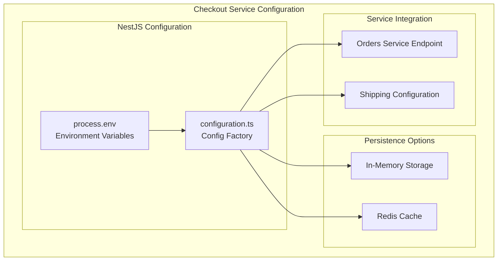

#### Checkout Service Environment Variables

| Variable | Description | Default |
|----------|-------------|---------|
| `RETAIL_CHECKOUT_PERSISTENCE_PROVIDER` | Storage backend | `in-memory` |
| `RETAIL_CHECKOUT_PERSISTENCE_REDIS_URL` | Redis connection URL | - |
| `RETAIL_CHECKOUT_ENDPOINTS_ORDERS` | Orders service URL | - |
| `RETAIL_CHECKOUT_SHIPPING_NAME_PREFIX` | Shipping name prefix | - |

#### Checkout Configuration Code

```typescript
// configuration.ts
export default () => ({
  persistence: {
    provider: process.env.RETAIL_CHECKOUT_PERSISTENCE_PROVIDER || 'in-memory',
    redis: {
      url: process.env.RETAIL_CHECKOUT_PERSISTENCE_REDIS_URL || '',
      reader: {
        url: process.env.RETAIL_CHECKOUT_PERSISTENCE_REDIS_READER_URL || '',
      },
    },
  },
  endpoints: {
    orders: process.env.RETAIL_CHECKOUT_ENDPOINTS_ORDERS || '',
  },
  shipping: {
    prefix: process.env.RETAIL_CHECKOUT_SHIPPING_NAME_PREFIX || '',
  },
});
```

### Orders Service (Java Spring Boot)

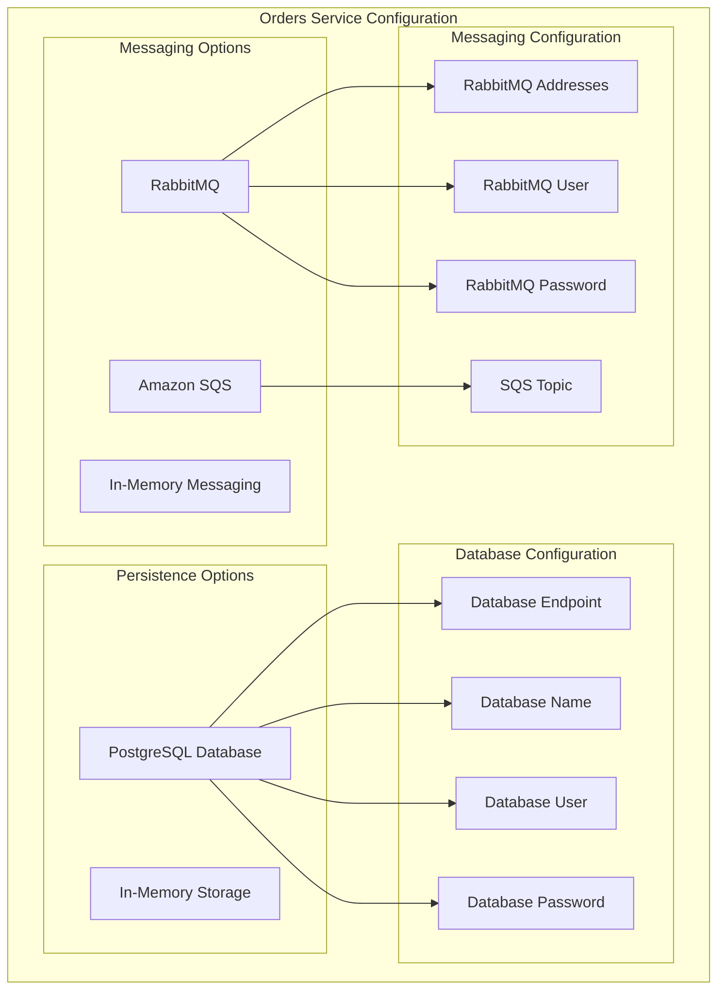

#### Orders Service Environment Variables

| Variable | Description | Default |
|----------|-------------|---------|
| `RETAIL_ORDERS_PERSISTENCE_PROVIDER` | Storage backend | `in-memory` |
| `RETAIL_ORDERS_PERSISTENCE_POSTGRES_ENDPOINT` | PostgreSQL endpoint | - |
| `RETAIL_ORDERS_PERSISTENCE_POSTGRES_NAME` | Database name | - |
| `RETAIL_ORDERS_PERSISTENCE_POSTGRES_USERNAME` | Database user | - |
| `RETAIL_ORDERS_PERSISTENCE_POSTGRES_PASSWORD` | Database password | - |
| `RETAIL_ORDERS_MESSAGING_PROVIDER` | Messaging backend | `in-memory` |
| `RETAIL_ORDERS_MESSAGING_RABBITMQ_ADDRESSES` | RabbitMQ addresses | - |
| `RETAIL_ORDERS_MESSAGING_SQS_TOPIC` | SQS topic name | - |

## Helm Chart Configuration

### Values Structure

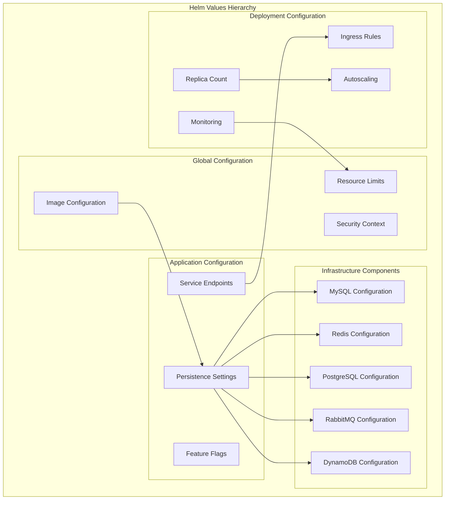

### Helm Values Example

```yaml
# Complete values.yaml structure
image:
  repository: 753862336389.dkr.ecr.us-west-2.amazonaws.com/retail-store-ui
  pullPolicy: Always
  tag: "96802ca"

app:
  persistence:
    provider: in-memory
    database: retail
    secret:
      create: true
      name: retail-db
      username: retail_user
      password: ""
  
  endpoints:
    catalog: http://retail-store-catalog:80
    carts: http://retail-store-cart-carts:80
    orders: http://retail-store-orders:80
    checkout: http://retail-store-checkout:80
  
  chat:
    enabled: false
    provider: ""
    model: ""

resources:
  limits:
    memory: 512Mi
  requests:
    cpu: 128m
    memory: 512Mi

autoscaling:
  enabled: false
  minReplicas: 1
  maxReplicas: 10

mysql:
  create: false
  image:
    repository: public.ecr.aws/docker/library/mysql
    tag: "8.0"
```

## ConfigMap Management

### ConfigMap Templates

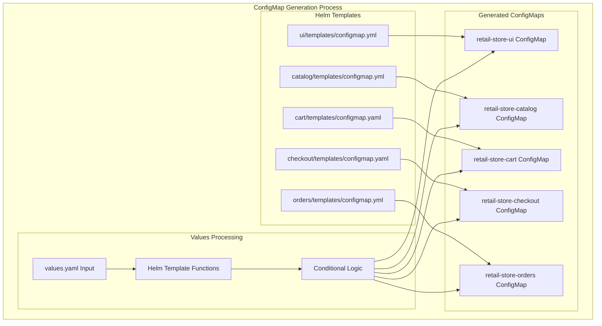

### ConfigMap Template Structure

```yaml
# Example: UI Service ConfigMap Template
{{- if .Values.configMap.create -}}
apiVersion: v1
kind: ConfigMap
metadata:
  name: {{ include "ui.configMapName" . }}
data:
  {{- if .Values.app.theme }}
  RETAIL_UI_THEME: {{ .Values.app.theme }}
  {{- end }}
  {{- if .Values.app.endpoints.catalog }}
  RETAIL_UI_ENDPOINTS_CATALOG: {{ .Values.app.endpoints.catalog }}
  {{- end }}
  {{- if .Values.app.endpoints.carts }}
  RETAIL_UI_ENDPOINTS_CARTS: {{ .Values.app.endpoints.carts }}
  {{- end }}
  {{- if .Values.app.chat.enabled }}
  RETAIL_UI_CHAT_ENABLED: "{{ .Values.app.chat.enabled }}"
  RETAIL_UI_CHAT_PROVIDER: {{ .Values.app.chat.provider }}
  {{- end }}
{{- end }}
```

### ConfigMap Injection

```yaml
# Deployment template showing ConfigMap usage
containers:
  - name: ui
    env:
      - name: JAVA_OPTS
        value: -XX:MaxRAMPercentage=75.0
      - name: METADATA_KUBERNETES_POD_NAME
        valueFrom:
          fieldRef:
            fieldPath: metadata.name
    envFrom:
      - configMapRef:
          name: {{ include "ui.configMapName" . }}
```

## Environment Variables Hierarchy

### Resolution Order

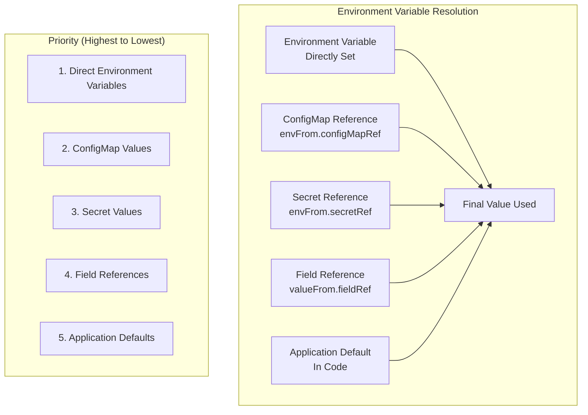

### Environment Variable Categories

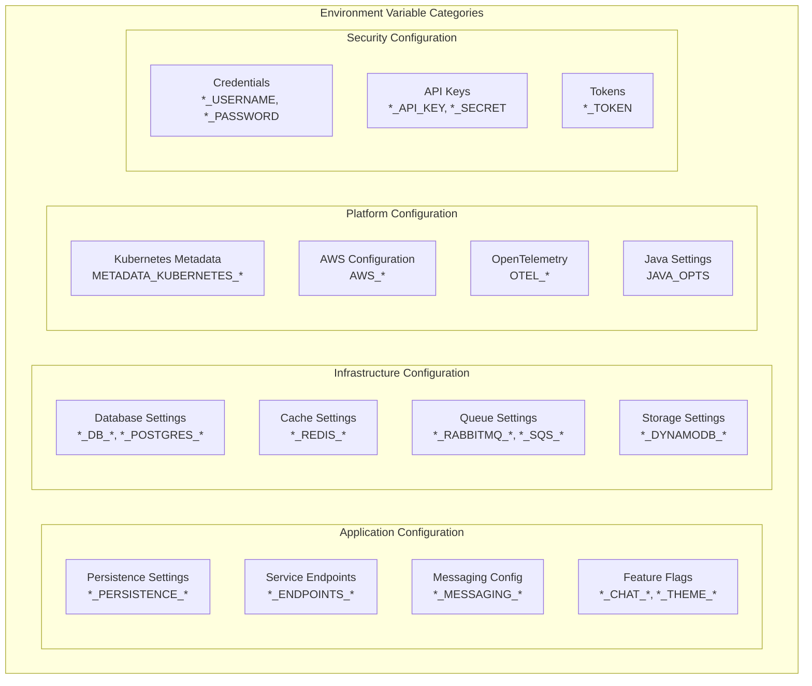

## Multi-Environment Support

### Environment-Specific Profiles

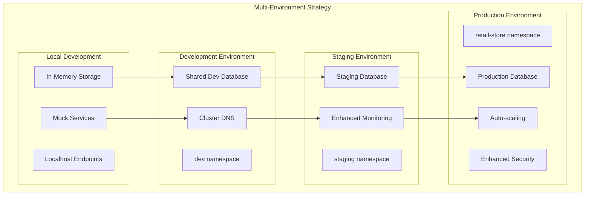

### Environment Configuration Matrix

| Component | Local | Development | Staging | Production |
|-----------|-------|-------------|---------|------------|
| **UI Service** | | | | |
| Persistence | In-Memory | In-Memory | In-Memory | In-Memory |
| Endpoints | localhost:808x | service-name:80 | service-name:80 | service-name:80 |
| Chat | Disabled | Disabled | Enabled | Enabled |
| **Catalog Service** | | | | |
| Persistence | In-Memory | MySQL | MySQL | MySQL |
| Database | - | dev-catalog-db | staging-catalog-db | prod-catalog-db |
| **Cart Service** | | | | |
| Persistence | In-Memory | DynamoDB Local | DynamoDB | DynamoDB |
| Table | - | dev-cart-items | staging-cart-items | prod-cart-items |
| **Checkout Service** | | | | |
| Persistence | In-Memory | Redis | Redis | Redis |
| Cache | - | dev-redis | staging-redis | prod-redis |
| **Orders Service** | | | | |
| Persistence | In-Memory | PostgreSQL | PostgreSQL | PostgreSQL |
| Messaging | In-Memory | RabbitMQ | RabbitMQ | RabbitMQ |
| Database | - | dev-orders-db | staging-orders-db | prod-orders-db |

### Environment-Specific Values

```yaml
# values-dev.yaml
app:
  persistence:
    provider: mysql
    endpoint: dev-mysql:3306
    database: catalog_dev
  endpoints:
    catalog: http://catalog-dev:80

# values-staging.yaml
app:
  persistence:
    provider: mysql
    endpoint: staging-mysql:3306
    database: catalog_staging
  monitoring:
    enabled: true

# values-prod.yaml
app:
  persistence:
    provider: mysql
    endpoint: prod-mysql:3306
    database: catalog_prod
  autoscaling:
    enabled: true
    minReplicas: 3
    maxReplicas: 20
  monitoring:
    enabled: true
  security:
    enhanced: true
```

## Configuration Security

### Secret Management

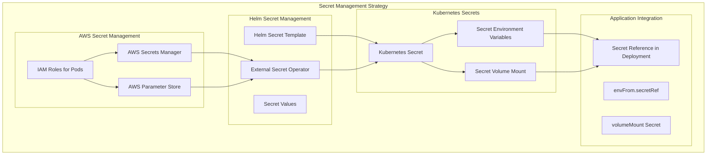

### Secret Templates

```yaml
# Secret template example
{{- if .Values.app.persistence.secret.create -}}
apiVersion: v1
kind: Secret
metadata:
  name: {{ .Values.app.persistence.secret.name }}
type: Opaque
data:
  username: {{ .Values.app.persistence.secret.username | b64enc }}
  password: {{ .Values.app.persistence.secret.password | b64enc }}
{{- end }}
```

### Security Best Practices

1. **Separate Secrets from Configuration**
   - Use Kubernetes Secrets for sensitive data
   - Use ConfigMaps for non-sensitive configuration
   - Never store secrets in values.yaml

2. **Environment Variable Segregation**
   - Use different prefixes for different types of configuration
   - Implement validation for required environment variables
   - Use secure defaults

3. **Access Control**
   - Use RBAC to control access to secrets
   - Implement pod-level security contexts
   - Use service accounts with minimal permissions

## Dynamic Configuration

### Runtime Configuration Updates

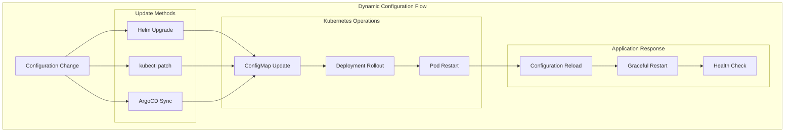

### Configuration Hot Reload

Some services support configuration hot reload without requiring pod restarts:

#### Spring Boot Services (UI, Cart, Orders)
- **Spring Boot Actuator**: Provides `/actuator/refresh` endpoint
- **Configuration Properties**: Can be reloaded using `@RefreshScope`
- **Environment Updates**: Requires application restart for environment variables

#### Go Service (Catalog)
- **Signal-based Reload**: Can implement SIGHUP handler for configuration reload
- **File Watching**: Can watch configuration files for changes
- **Environment Variables**: Requires application restart

#### Node.js Service (Checkout)
- **Configuration Module**: Can implement dynamic configuration loading
- **Environment Variables**: Requires application restart

## Best Practices

### Configuration Management

1. **Use Layered Configuration**
   ```yaml
   # Start with secure defaults
   app:
     persistence:
       provider: in-memory  # Safe default
   
   # Override for specific environments
   app:
     persistence:
       provider: postgres   # Production setting
       endpoint: prod-db:5432
   ```

2. **Environment Variable Naming**
   ```bash
   # Use consistent naming convention
   RETAIL_{SERVICE}_{CATEGORY}_{SETTING}
   
   # Examples:
   RETAIL_UI_ENDPOINTS_CATALOG
   RETAIL_ORDERS_PERSISTENCE_PROVIDER
   RETAIL_CART_MESSAGING_RABBITMQ_ADDRESS
   ```

3. **Validation and Defaults**
   ```go
   // Go example with validation
   type Config struct {
       Port     int    `env:"PORT,default=8080" validate:"min=1024,max=65535"`
       Provider string `env:"PERSISTENCE_PROVIDER,default=in-memory" validate:"oneof=in-memory mysql"`
   }
   ```

   ```java
   // Java example with validation
   @Value("${retail.orders.persistence.provider:in-memory}")
   @Pattern(regexp = "in-memory|postgres")
   private String persistenceProvider;
   ```

### Security Practices

1. **Secret Rotation**
   - Implement automatic secret rotation
   - Use external secret management systems
   - Monitor secret access and usage

2. **Least Privilege**
   - Use service accounts with minimal permissions
   - Implement pod security contexts
   - Use network policies to restrict communication

3. **Audit and Monitoring**
   - Log configuration changes
   - Monitor secret access
   - Implement configuration drift detection

### Testing Strategies

1. **Configuration Testing**
   ```bash
   # Test with different configurations
   helm template . --values values-dev.yaml
   helm template . --values values-staging.yaml
   helm template . --values values-prod.yaml
   ```

2. **Environment Validation**
   ```bash
   # Validate environment variables
   kubectl exec deployment/ui -- env | grep RETAIL_
   kubectl describe configmap ui-config
   ```

3. **Integration Testing**
   - Test service-to-service communication
   - Validate database connections
   - Test feature flag behavior

## Troubleshooting

### Common Issues

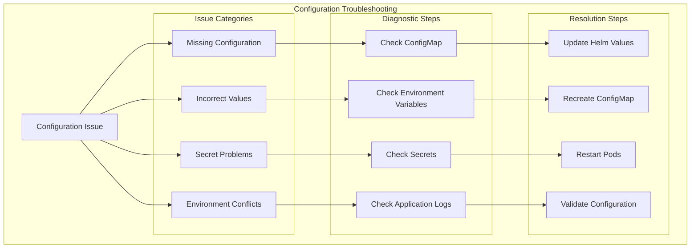

### Diagnostic Commands

```bash
# Check ConfigMaps
kubectl get configmaps -n retail-store
kubectl describe configmap retail-store-ui -n retail-store
kubectl get configmap retail-store-ui -o yaml -n retail-store

# Check Secrets
kubectl get secrets -n retail-store
kubectl describe secret retail-store-db -n retail-store

# Check Environment Variables in Pods
kubectl exec deployment/retail-store-ui -n retail-store -- env | grep RETAIL_
kubectl exec deployment/retail-store-ui -n retail-store -- printenv | sort

# Check Pod Configuration
kubectl describe pod -l app=retail-store-ui -n retail-store
kubectl get pod -l app=retail-store-ui -o yaml -n retail-store

# Check Helm Values
helm get values retail-store-ui -n retail-store
helm template retail-store-ui ./src/ui/chart --values ./src/ui/chart/values.yaml

# Check Service Endpoints
kubectl get endpoints -n retail-store
kubectl describe service retail-store-catalog -n retail-store

# Application Health and Logs
kubectl logs deployment/retail-store-ui -n retail-store
kubectl port-forward deployment/retail-store-ui 8080:8080 -n retail-store
curl http://localhost:8080/actuator/health
```

### Issue Resolution Guide

| Issue | Symptoms | Resolution |
|-------|----------|------------|
| **Missing Environment Variables** | Service fails to start, connection errors | Check ConfigMap template, update Helm values |
| **Incorrect Service Endpoints** | Service communication failures | Verify service names and ports in values.yaml |
| **Secret Access Issues** | Authentication failures | Check secret exists, verify RBAC permissions |
| **Configuration Not Applied** | Old configuration still active | Restart deployment, check ConfigMap update |
| **Database Connection Failed** | Persistence errors in logs | Verify database endpoint and credentials |
| **Feature Flags Not Working** | Features not enabling/disabling | Check boolean value formatting in ConfigMap |

### Performance Considerations

1. **ConfigMap Size Limits**
   - Maximum size: 1MB per ConfigMap
   - Split large configurations across multiple ConfigMaps
   - Use external configuration sources for large data

2. **Environment Variable Limits**
   - Kubernetes limit: 64KB total environment data per container
   - Use ConfigMap volume mounts for large configurations
   - Optimize environment variable names

3. **Configuration Reload Performance**
   - Minimize configuration changes
   - Use configuration caching where appropriate
   - Implement graceful configuration updates

## Conclusion

The Retail Store Sample App demonstrates a comprehensive environment management strategy that balances flexibility, security, and maintainability. By using a layered configuration approach with Helm charts, Kubernetes ConfigMaps, and environment variables, the application can adapt to different deployment scenarios while maintaining consistent behavior across environments.

Key benefits of this approach:

- **Flexibility**: Support for multiple persistence backends and deployment scenarios
- **Security**: Proper separation of secrets and configuration
- **Maintainability**: Centralized configuration management through Helm
- **Observability**: Clear configuration hierarchy and debugging capabilities
- **Scalability**: Environment-specific overrides and dynamic configuration updates

This environment management strategy serves as a solid foundation for production-ready cloud-native applications.
