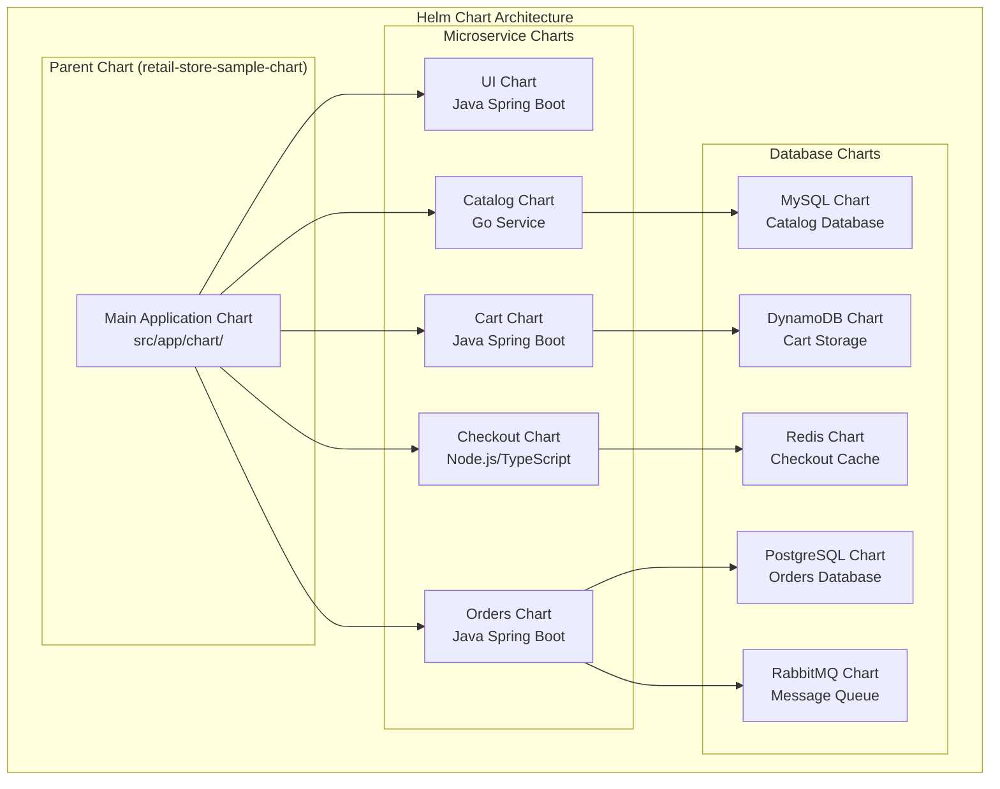
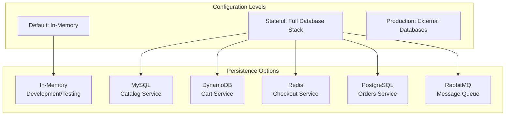
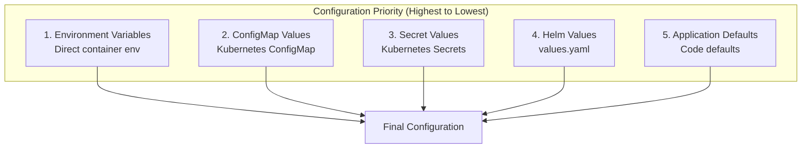
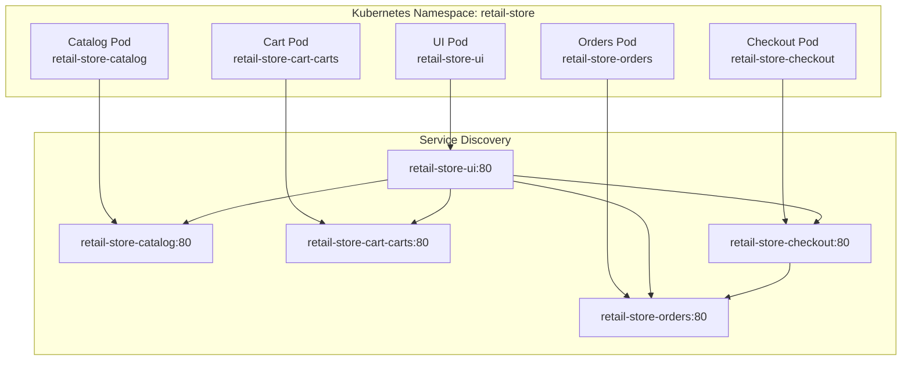

# Helm Charts Detailed Guide for Retail Store Microservices

## Table of Contents

1. [Overview](#overview)
2. [Architecture Overview](#architecture-overview)
3. [Helm Chart Structure](#helm-chart-structure)
4. [Microservices Configuration](#microservices-configuration)
5. [Database Management](#database-management)
6. [Environment Variables](#environment-variables)
7. [Service Discovery & Communication](#service-discovery--communication)
8. [Deployment Strategies](#deployment-strategies)
9. [Security & Best Practices](#security--best-practices)
10. [Troubleshooting](#troubleshooting)

## Overview

This retail store application uses a comprehensive Helm chart architecture to deploy and manage microservices on Kubernetes. The system consists of 5 main microservices, each with its own Helm chart, orchestrated by a parent chart that manages dependencies and configurations.

### Key Components

- **5 Microservices**: UI, Catalog, Cart, Checkout, Orders
- **Multiple Databases**: MySQL, DynamoDB, Redis, PostgreSQL, RabbitMQ
- **Service Discovery**: Kubernetes DNS-based communication
- **Configuration Management**: Layered configuration with Helm values
- **Environment Support**: Development, staging, and production configurations

## Architecture Overview



## Helm Chart Structure

### Parent Chart (Main Application)

**Location**: `src/app/chart/`

```yaml
# Chart.yaml
apiVersion: v2
name: retail-store-sample-chart
description: A Helm chart for the AWS retail store containers sample application
type: application
version: 1.2.2
dependencies:
  - name: retail-store-sample-cart-chart
    alias: cart
    version: 1.2.2
    repository: file://../../cart/chart
  - name: retail-store-sample-catalog-chart
    alias: catalog
    version: 1.2.2
    repository: file://../../catalog/chart
  - name: retail-store-sample-checkout-chart
    alias: checkout
    version: 1.2.2
    repository: file://../../checkout/chart
  - name: retail-store-sample-orders-chart
    alias: orders
    version: 1.2.2
    repository: file://../../orders/chart
  - name: retail-store-sample-ui-chart
    alias: ui
    version: 1.2.2
    repository: file://../../ui/chart
```

### Individual Microservice Charts

Each microservice follows a consistent structure:

```
src/{service}/chart/
├── Chart.yaml              # Chart metadata
├── values.yaml             # Default configuration values
├── values-stateful.yaml    # Stateful database configurations
└── templates/
    ├── _helpers.tpl        # Template helpers
    ├── deployment.yaml     # Kubernetes Deployment
    ├── service.yaml        # Kubernetes Service
    ├── configmap.yaml      # Configuration data
    ├── serviceaccount.yaml # Service account
    ├── hpa.yaml            # Horizontal Pod Autoscaler
    └── pdb.yaml            # Pod Disruption Budget
```

## Microservices Configuration

### 1. UI Service (Java Spring Boot)

**Purpose**: Frontend application serving the retail store interface

**Configuration**:
```yaml
# src/ui/chart/values.yaml
replicaCount: 1
image:
  repository: 753862336389.dkr.ecr.us-west-2.amazonaws.com/retail-store-ui
  tag: "96802ca"
  pullPolicy: Always

app:
  endpoints:
    catalog: http://retail-store-catalog:80
    carts: http://retail-store-cart-carts:80
    orders: http://retail-store-orders:80
    checkout: http://retail-store-checkout:80
  chat:
    enabled: false
    provider: ""
    model: ""

resources:
  limits:
    memory: 512Mi
  requests:
    cpu: 128m
    memory: 512Mi
```

**Key Features**:
- Spring Boot application with embedded Tomcat
- Service discovery through environment variables
- Configurable chat integration (Bedrock/OpenAI)
- Multiple ingress configurations (direct ELB, domain-based)
- SSL/TLS support with cert-manager

### 2. Catalog Service (Go)

**Purpose**: Product catalog management and search

**Configuration**:
```yaml
# src/catalog/chart/values.yaml
replicaCount: 1
image:
  repository: 753862336389.dkr.ecr.us-west-2.amazonaws.com/retail-store-catalog
  tag: "47c0101"

app:
  persistence:
    provider: in-memory
    endpoint: ""
    database: "catalog"
    secret:
      create: true
      name: catalog-db
      username: catalog
      password: ""

mysql:
  create: false
  image:
    repository: public.ecr.aws/docker/library/mysql
    tag: "8.0"
  service:
    type: ClusterIP
    port: 3306
```

**Key Features**:
- Go-based REST API with Gin framework
- Flexible persistence (in-memory or MySQL)
- Prometheus metrics integration
- Health check endpoints
- Chaos engineering support

### 3. Cart Service (Java Spring Boot)

**Purpose**: Shopping cart management and item storage

**Configuration**:
```yaml
# src/cart/chart/values.yaml
replicaCount: 1
image:
  repository: 753862336389.dkr.ecr.us-west-2.amazonaws.com/retail-store-cart
  tag: "47c0101"

app:
  persistence:
    provider: in-memory
    dynamodb:
      tableName: Items
      createTable: false

dynamodb:
  create: false
  image:
    repository: public.ecr.aws/aws-dynamodb-local/aws-dynamodb-local
    tag: "1.25.1"
  service:
    type: ClusterIP
    port: 8000
```

**Key Features**:
- Spring Boot with Spring Data JPA
- DynamoDB integration for cart storage
- Session-based cart management
- Health checks and metrics

### 4. Checkout Service (Node.js/TypeScript)

**Purpose**: Order processing and payment handling

**Configuration**:
```yaml
# src/checkout/chart/values.yaml
replicaCount: 1
image:
  repository: 753862336389.dkr.ecr.us-west-2.amazonaws.com/retail-store-checkout
  tag: "47c0101"

app:
  persistence:
    provider: 'in-memory'
    redis:
      endpoint: ''
  endpoints:
    orders: http://retail-store-orders:80

redis:
  create: false
  image:
    repository: public.ecr.aws/docker/library/redis
    tag: "6.0-alpine"
  service:
    type: ClusterIP
    port: 6379
```

**Key Features**:
- NestJS framework with TypeScript
- Redis integration for session management
- Order service integration
- Chaos engineering middleware

### 5. Orders Service (Java Spring Boot)

**Purpose**: Order management and event publishing

**Configuration**:
```yaml
# src/orders/chart/values.yaml
replicaCount: 1
image:
  repository: 753862336389.dkr.ecr.us-west-2.amazonaws.com/retail-store-orders
  tag: "47c0101"

app:
  persistence:
    provider: 'in-memory'
    endpoint: ''
    database: 'orders'
    secret:
      create: true
      name: orders-db
      username: orders
      password: ""
  messaging:
    provider: 'in-memory'
    rabbitmq:
      addresses: []
      secret:
        create: true
        name: orders-rabbitmq
        username: ""
        password: ""

postgresql:
  create: false
  image:
    repository: public.ecr.aws/docker/library/postgres
    tag: "13"
  service:
    type: ClusterIP
    port: 5432

rabbitmq:
  create: false
  image:
    repository: public.ecr.aws/docker/library/rabbitmq
    tag: "3.8-management"
  service:
    type: ClusterIP
    amqp:
      port: 5672
    http:
      port: 15672
```

**Key Features**:
- Spring Boot with JPA/Hibernate
- PostgreSQL for order persistence
- RabbitMQ for event messaging
- Order lifecycle management
- Event-driven architecture

## Database Management

### Database Configuration Strategy

The application supports multiple persistence strategies:



### Database Deployment Options

#### 1. In-Memory Mode (Default)
```yaml
# All services use in-memory storage
app:
  persistence:
    provider: in-memory
```

#### 2. Stateful Mode (values-stateful.yaml)
```yaml
# Full database stack deployment
cart:
  app:
    persistence:
      provider: dynamodb
  dynamodb:
    create: true

catalog:
  app:
    persistence:
      provider: 'mysql'
  mysql:
    create: true

checkout:
  app:
    persistence:
      provider: redis
  redis:
    create: true

orders:
  app:
    persistence:
      provider: 'postgres'
    messaging:
      provider: 'rabbitmq'
  postgresql:
    create: true
  rabbitmq:
    create: true
```

#### 3. Production Mode (External Databases)
```yaml
# External database endpoints
app:
  persistence:
    provider: mysql
    endpoint: "prod-mysql-cluster:3306"
    database: "catalog_prod"
```

## Environment Variables

### Configuration Hierarchy



### Environment Variable Categories

#### 1. Service Configuration
```bash
# Service endpoints
RETAIL_UI_ENDPOINTS_CATALOG=http://catalog:80
RETAIL_UI_ENDPOINTS_CARTS=http://carts:80
RETAIL_UI_ENDPOINTS_ORDERS=http://orders:80
RETAIL_UI_ENDPOINTS_CHECKOUT=http://checkout:80

# Persistence configuration
RETAIL_CATALOG_PERSISTENCE_PROVIDER=mysql
RETAIL_CATALOG_PERSISTENCE_ENDPOINT=catalog-db:3306
RETAIL_CATALOG_PERSISTENCE_DB_NAME=catalogdb
```

#### 2. Database Credentials
```bash
# MySQL credentials
RETAIL_CATALOG_PERSISTENCE_USER=catalog
RETAIL_CATALOG_PERSISTENCE_PASSWORD=secure_password

# DynamoDB configuration
RETAIL_CART_PERSISTENCE_DYNAMODB_TABLE_NAME=Items
RETAIL_CART_PERSISTENCE_DYNAMODB_ENDPOINT=http://dynamodb:8000

# Redis configuration
RETAIL_CHECKOUT_PERSISTENCE_REDIS_URL=redis://redis:6379

# PostgreSQL credentials
RETAIL_ORDERS_PERSISTENCE_USER=orders
RETAIL_ORDERS_PERSISTENCE_PASSWORD=secure_password
```

#### 3. Messaging Configuration
```bash
# RabbitMQ configuration
RETAIL_ORDERS_MESSAGING_RABBITMQ_ADDRESSES=rabbitmq:5672
RETAIL_ORDERS_MESSAGING_RABBITMQ_USERNAME=guest
RETAIL_ORDERS_MESSAGING_RABBITMQ_PASSWORD=guest
```

### ConfigMap Generation

Each service generates its ConfigMap from Helm values:

```yaml
# Example: Catalog Service ConfigMap
apiVersion: v1
kind: ConfigMap
metadata:
  name: retail-store-catalog
data:
  RETAIL_CATALOG_PERSISTENCE_PROVIDER: mysql
  RETAIL_CATALOG_PERSISTENCE_ENDPOINT: catalog-db:3306
  RETAIL_CATALOG_PERSISTENCE_DB_NAME: catalogdb
```

## Service Discovery & Communication

### Kubernetes DNS-Based Service Discovery



### Service Communication Flow

1. **UI Service** acts as the frontend gateway
2. **Internal API calls** use Kubernetes service names
3. **Load balancing** handled by Kubernetes services
4. **Health checks** ensure service availability

### Service Configuration Example

```yaml
# UI Service endpoints configuration
app:
  endpoints:
    catalog: http://catalog:80
    carts: http://carts:80
    checkout: http://checkout:80
    orders: http://orders:80
```

## Deployment Strategies

### 1. Development Deployment

```bash
# Deploy with in-memory storage
helm install retail-store ./src/app/chart \
  --namespace retail-store \
  --create-namespace
```

### 2. Stateful Deployment

```bash
# Deploy with full database stack
helm install retail-store ./src/app/chart \
  --namespace retail-store \
  --create-namespace \
  --values ./src/app/chart/values-stateful.yaml
```

### 3. Production Deployment

```bash
# Deploy with external databases
helm install retail-store ./src/app/chart \
  --namespace retail-store \
  --create-namespace \
  --values ./values-prod.yaml
```

### 4. ArgoCD GitOps Deployment

```yaml
# argocd/applications/retail-store-ui.yaml
apiVersion: argoproj.io/v1alpha1
kind: Application
metadata:
  name: retail-store-ui
  namespace: argocd
spec:
  project: retail-store
  source:
    repoURL: https://github.com/aws-samples/retail-store-sample-app
    targetRevision: HEAD
    path: src/ui/chart
  destination:
    server: https://kubernetes.default.svc
    namespace: retail-store
  syncPolicy:
    automated:
      prune: true
      selfHeal: true
```

## Security & Best Practices

### 1. Pod Security Contexts

```yaml
# Security context for all services
securityContext:
  capabilities:
    drop:
      - ALL
  readOnlyRootFilesystem: true
  runAsNonRoot: true
  runAsUser: 1000

podSecurityContext:
  fsGroup: 1000
```

### 2. Resource Limits

```yaml
# Resource constraints
resources:
  limits:
    memory: 512Mi
    cpu: 500m
  requests:
    cpu: 128m
    memory: 256Mi
```

### 3. Network Policies

```yaml
# Example network policy
apiVersion: networking.k8s.io/v1
kind: NetworkPolicy
metadata:
  name: retail-store-network-policy
spec:
  podSelector:
    matchLabels:
      app.kubernetes.io/owner: retail-store-sample
  policyTypes:
  - Ingress
  - Egress
  ingress:
  - from:
    - namespaceSelector:
        matchLabels:
          name: retail-store
```

### 4. Secret Management

```yaml
# Database secrets
apiVersion: v1
kind: Secret
metadata:
  name: catalog-db
type: Opaque
data:
  RETAIL_CATALOG_PERSISTENCE_USERNAME: Y2F0YWxvZw==
  RETAIL_CATALOG_PERSISTENCE_PASSWORD: c2VjdXJlX3Bhc3N3b3Jk
```

## Troubleshooting

### Common Issues

#### 1. Service Discovery Problems

**Problem**: Services cannot communicate with each other

**Solution**:
```bash
# Check service endpoints
kubectl get endpoints -n retail-store

# Check DNS resolution
kubectl run test-pod --image=busybox --rm -it -- nslookup retail-store-catalog

# Check service connectivity
kubectl run test-pod --image=busybox --rm -it -- wget -O- http://retail-store-catalog:80/health
```

#### 2. Database Connection Issues

**Problem**: Services cannot connect to databases

**Solution**:
```bash
# Check database pods
kubectl get pods -n retail-store | grep -E "(mysql|postgres|redis|dynamodb)"

# Check database services
kubectl get svc -n retail-store | grep -E "(mysql|postgres|redis|dynamodb)"

# Check database logs
kubectl logs -n retail-store deployment/retail-store-catalog
```

#### 3. Configuration Issues

**Problem**: Environment variables not being set correctly

**Solution**:
```bash
# Check ConfigMap
kubectl get configmap -n retail-store
kubectl describe configmap retail-store-catalog

# Check environment variables in pod
kubectl exec -n retail-store deployment/retail-store-catalog -- env | grep RETAIL

# Check Helm values
helm get values retail-store -n retail-store
```

#### 4. Resource Issues

**Problem**: Pods failing to start due to resource constraints

**Solution**:
```bash
# Check resource usage
kubectl top pods -n retail-store

# Check node resources
kubectl top nodes

# Adjust resource limits in values.yaml
resources:
  limits:
    memory: 1Gi
    cpu: 1000m
  requests:
    cpu: 200m
    memory: 512Mi
```

### Monitoring and Observability

#### 1. Health Checks

```bash
# Check service health
kubectl get pods -n retail-store
kubectl describe pod <pod-name> -n retail-store

# Check service endpoints
curl http://retail-store-catalog:80/health
curl http://retail-store-catalog:80/topology
```

#### 2. Metrics Collection

```bash
# Check Prometheus metrics
curl http://retail-store-catalog:8080/metrics

# Check service topology
curl http://retail-store-catalog:80/topology
```

#### 3. Log Analysis

```bash
# Check application logs
kubectl logs -n retail-store deployment/retail-store-catalog --tail=100

# Follow logs in real-time
kubectl logs -n retail-store deployment/retail-store-catalog -f
```

## Conclusion

This Helm chart architecture provides a robust, scalable, and maintainable solution for deploying microservices on Kubernetes. The layered configuration approach, comprehensive database support, and service discovery mechanisms make it suitable for development, staging, and production environments.

Key benefits:
- **Modularity**: Each service has its own chart
- **Flexibility**: Multiple persistence options
- **Scalability**: Horizontal pod autoscaling support
- **Security**: Pod security contexts and network policies
- **Observability**: Health checks and metrics integration
- **GitOps**: ArgoCD integration for continuous deployment

The architecture supports both simple in-memory deployments for development and complex stateful deployments for production, making it suitable for various use cases and environments.
